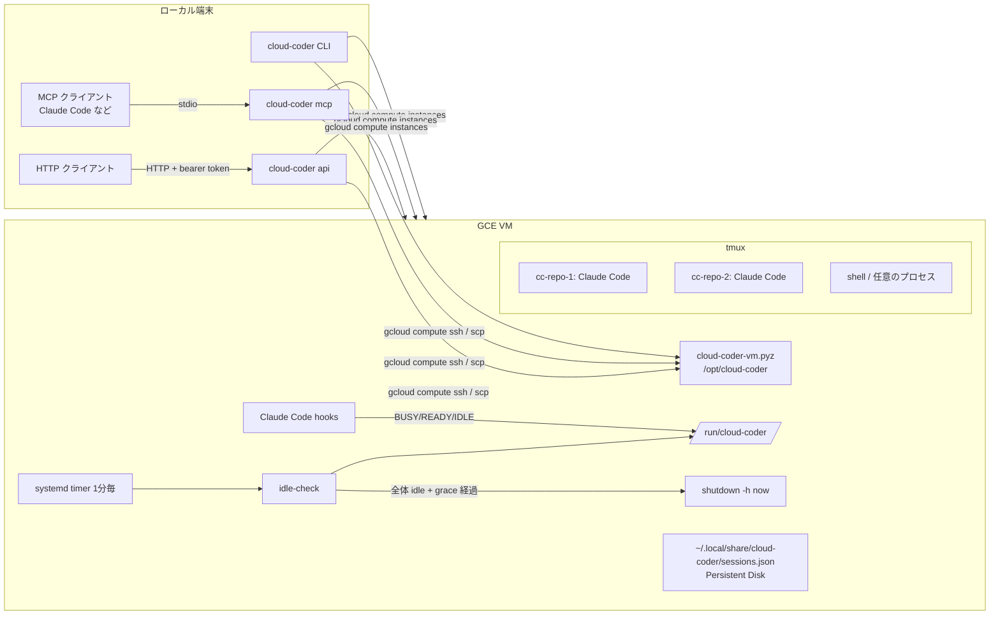

# cloud-coder

`gcloud` が使える端末から、任意の GCP project に Claude Code 専用の GCE VM を用意し、tmux 経由で操作するための CLI です。
Claude Code の hook と tmux の状態から VM 全体が idle になったことを判定し、grace period の後に VM を自動停止します。
停止しても Persistent Disk は残るので、次の `connect` で VM を起動し、同じ作業環境と Claude Code セッションに戻れます。

```bash
cloud-coder connect git@github.com:OWNER/REPO.git
```

初回セットアップや日々の操作など、やりたいこと別の手順は [how-to-use.md](how-to-use.md) にまとめています。

## 仕組み



- ローカル側 (`src/cloud_coder`) は GCE の作成・起動・停止と SSH を `gcloud` で行います。依存は PyYAML、MCP Python SDK (`mcp`、MCP server 用)、Starlette と uvicorn (HTTP API 用) です。
- 操作 (`connect.py` / `gce.py` / `ssh.py`) は結果を返し、失敗は例外で知らせます。CLI、MCP server、HTTP API はその上の薄い adapter です。MCP server と HTTP API が共有する安全側の判定 (プロンプトの検査、VM が ready かの確認) は `guards.py` にあります。
- VM 側 (`src/cloud_coder_vm`) は標準ライブラリだけで書かれ、zipapp (`cloud-coder-vm.pyz`) として配布されます。`up` / `connect` のたびにハッシュを比較し、変わっていれば scp してインストールし直します。
- `connect` は各ステップで状態を確認し、足りないものだけを用意します (VM → SSH → agent → repo → tmux → Claude Code → attach)。既存の repository を pull / reset することはありません。

## 必要なもの

- Python 3.12 以上と [uv](https://docs.astral.sh/uv/)
- [Google Cloud CLI](https://cloud.google.com/sdk/docs/install) (`gcloud auth login` 済み) と、対象 project で Compute Engine を操作できる権限
- VM へ SSH (tcp:22) できる firewall ルール。`default` network の `default-allow-ssh` があればそのまま使えます。IAP を使う場合は `35.235.240.0/20` からの tcp:22 を許可してください。
- Claude Code の Pro / Max / Team / Enterprise のいずれかのプラン (Remote Control に必要)

## インストール

```bash
uv tool install git+https://github.com/TTRSQ/cloud-coder.git
# 開発時: uv sync && uv run cloud-coder --help
```

## 使い方

最初に `~/.config/cloud-coder/config.yaml` に対象の `gcp.project` を書きます ([設定](#設定))。`gcloud` の既定 project は使いません。

```bash
cloud-coder connect git@github.com:OWNER/REPO.git   # 初回: VM 作成 → clone → tmux → Claude Code → attach
cloud-coder connect                                 # 直近のセッションへ戻る
cloud-coder connect REPO                            # REPO の直近のセッションへ戻る
cloud-coder connect REPO --new                      # REPO で別の Claude Code を git worktree 上に起動する
cloud-coder connect --session cc-REPO-2             # セッション名を指定して戻る
cloud-coder connect REPO -p "テストを直して" --detach         # タスクを新しいセッションで始めて放置 (終われば自動停止)
cloud-coder connect --session cc-REPO-2 -p "続けて" --detach  # そのセッションの会話の続きとして指示する
cloud-coder connect REPO --prompt-file task.md       # プロンプトをファイルから (- で標準入力)
cloud-coder close cc-REPO-2                         # セッションを閉じて worktree を片付ける
cloud-coder status                                  # VM / セッション / 自動停止の可否
cloud-coder stop                                    # VM を停止する (disk は残る)
cloud-coder up                                      # VM の作成・起動と agent のインストールだけ行う
cloud-coder mcp                                     # MCP server として stdio で待ち受ける (下の「MCP server」)
cloud-coder api                                     # HTTP API を 127.0.0.1:8787 で待ち受ける (下の「HTTP API」)
```

- tmux から抜けるときは detach (`Ctrl-b d`) します。SSH が切れても tmux 内の Claude Code や他のプロセスは動き続けます。
- `connect` のオプション: `--no-attach` / `--detach` (attach しない)、`--no-claude` (Claude Code を起動しない)、`-p` / `--prompt` / `--prompt-file` (Claude Code に渡すタスク)。

### プロンプトを渡す

- プロンプトを渡すと、既定では新しいセッション (2 つ目以降は git worktree、[セッション](#セッション)) と新しい Claude Code の会話で始めます (`--new` と同じ)。既存の会話の続きにするのは `--session <名前>` を指定したときだけです。どちらにするかは送る側が決めます。
- プロンプトがあって `--session` もリポジトリも無いときはエラーにします (どのリポジトリで始めるか決まらないため。直近のセッションには送りません)。
- プロンプトが無い `connect` (attach して見るとき) は、従来どおり直近のセッションに戻ります。
- 応答 (`connect` の JSON 出力、MCP `start_session` と `POST /v1/sessions` の結果) の `created` はセッションを新しく作ったか (`true` / `false`)、`conversation` は Claude Code の会話が新しいか続きか (`new` / `continued`) を示します。`conversation` は Claude Code を起動しないとき (`--no-claude`) にはありません。`--session` で指定したセッションでも、まだ会話の履歴が無ければ `new` になります。
- Claude Code を新しく起動 / resume するときは、`claude ... --remote-control <名前> -- "<prompt>"` の位置引数として最初のプロンプトを渡します。プロンプトは base64 で VM に送り、一時ファイル経由で展開するので、複数行・引用符・`$` などもそのまま届きます。
- 既に Claude Code が動いているセッションには、その Claude Code が `READY` か `IDLE` のときだけ tmux の bracketed paste で入力して Enter を送ります。`BUSY` やまだ状態を報告していない場合は何も入力せずにエラー終了します (作業中の入力を壊さないため)。
- `--detach` と組み合わせると、タスクを投げて放置し、終わって idle になったら VM が自動停止する、という使い方が CLI だけでできます。
- private repository の clone 方法は 2 通りあります。
  - SSH URL (`git@github.com:OWNER/REPO.git`): `connect` はローカルの ssh-agent を VM に転送します (`ssh -A`) ので、鍵を agent に登録しておけば clone できます。転送は `connect` の間だけなので、VM 上での後の `git push` などには使えません。
  - HTTPS URL (`https://github.com/OWNER/REPO.git`): 下の「GitHub の認証」で `gh auth setup-git` を済ませておけば、clone も push も gh の認証で行えます。継続的に使うならこちらを推奨します。
  - 既定では VM の `~/.gitconfig` に `url."https://github.com/".insteadOf` として `git@github.com:` と `ssh://git@github.com/` を追加するので、SSH 形式の GitHub URL も HTTPS + gh の認証で clone / push されます (VM に SSH 鍵を置く必要がありません)。追加するのはこの 2 つの値だけで、`gh auth setup-git` の credential helper など他の設定は変更しません。無効にするには `git.github_https: false` にします (この 2 つの値を取り除きます)。

### セッション

`cloud-coder` のセッションは「repository / worktree」と「Claude Code の session ID」の組で、名前はそのまま tmux session 名になります (`cc-<repo>-<n>`)。

| セッション | 作業ディレクトリ |
| --- | --- |
| `cc-<repo>-1` | `~/git/<repo>` (clone) |
| `cc-<repo>-N` (`--new`) | `~/git/wt/<repo>-N` (branch `cloud-coder/cc-<repo>-N` の git worktree) |

- 置き場所は `vm.workspace` (clone、既定 `git`) と `vm.worktrees` (worktree、既定 `git/wt`) で変えられます。`~/git/wt` は worktree を `WORKTREE_BASE_DIR=~/git/wt` に作る運用に合わせています。
- 以前の既定だった `~/workspace` にある clone やセッションはそのまま使えます。対応表は絶対パスを記録しているので、既存のセッションは元の場所で動き続けます。`~/workspace/<repo>` に clone があるリポジトリは、`--new` の worktree (`~/git/wt/<repo>-N`) もその clone から作り、`~/git` に 2 つ目の clone は作りません。cloud-coder が `~/workspace` を移動・削除することはありません。
- 新しいセッションが既にある clone を使うとき (clone 先にディレクトリがある場合や、`--new` の worktree の元になる clone) は、その `origin` が指定した URL と同じリポジトリの場合だけ使います (違えばエラー。手で clone したものを別リポジトリとして使ったり trust したりしないため)。URL ではなく名前だけで `connect <repo>` した場合はそのディレクトリを使いますが、trust の自動承認は `origin` がセッションの URL と一致する clone に限るので、URL の無いセッションや `origin` を変えた clone では行いません (connect が警告を出し、tmux で Claude Code の trust 画面に答える必要があります)。

- Claude Code は `claude --session-id <uuid> --remote-control <セッション名>` で起動されます。Remote Control で claude.ai / Claude アプリからも操作できます。
- 対応表は VM の `~/.local/share/cloud-coder/sessions.json` (Persistent Disk) に保存されます。`/clear` などで Claude Code の session ID が変わると hook が対応表を更新します。
- VM の停止後にプロンプト無しで `connect` するか、`--session` を指定して `connect` すると tmux session を作り直し、`claude --resume <session-id> --remote-control <セッション名>` で同じ会話を再開します。
- 既に Claude Code が動いているセッションへの `connect` は attach だけ行い、二重に起動しません。Claude Code が終了していた場合は、入力途中の行を壊さないよう既存の pane ではなく新しい window で起動します (pane を使うのは tmux session をその場で作ったときだけです)。

### tmux server の分離

cloud-coder のセッションは、VM ユーザーの既定の tmux server ではなく専用の server (`tmux -L cloud-coder`) で動きます。Claude Code は環境変数 `TMUX` を外して起動します (`env -u TMUX claude ...`)。Claude Code やそのサブエージェントがテストなどで素の `tmux` を実行しても (`tmux kill-server` を含む)、届くのは既定の server で、cloud-coder のセッションは落ちません。`TMUX_PANE` は hook が状態をどの pane のものか判別するのに使うので残しています。

- VM 上でセッションを手で操作するときは `-L cloud-coder` を付けます (`tmux -L cloud-coder ls`、`tmux -L cloud-coder attach -t cc-REPO-1`)。`connect` の attach は自動で付けます。
- 自分で開いた window や pane のシェルには tmux が `TMUX` を設定するので、そこで打つ `tmux` は cloud-coder の server に届きます (人が操作する前提)。
- 自動停止の判定は、cloud-coder の server と既定の server の両方の pane を見ます。Claude Code が素の `tmux` で起動したコマンドが動いている間も VM は止まりません。
- 移行: 以前の版は既定の server でセッションを動かしていました。agent を更新した時点で動いていたセッションはそのまま既定の server で動き続け、自動停止の判定にも入ります。そのセッションへの `connect` は、同じ会話を 2 つの Claude Code で開かないようエラーにします。`close` も、動いている Claude Code の下で worktree を消さないようエラーにします。`cloud-coder status` ではそのセッションの tmux は `absent` と表示されます。VM 上で `tmux -L default kill-session -t =cc-REPO-N` で終了するか、VM を停止してから `connect` し直すと専用の server で起動します。

### 開発ツール

VM には次のツールを入れます (`vm.tools` で選択、既定はすべて)。いずれも boot disk (Persistent Disk) 上に入るので停止しても残ります。インストールは agent か config が変わったときだけ実行され、既に入っているツールは飛ばします。

| ツール | 入れ方 | 場所 |
| --- | --- | --- |
| `gh` | GitHub CLI 公式 apt repository ([手順](https://github.com/cli/cli/blob/trunk/docs/install_linux.md)) | `/usr/bin/gh` |
| `node` | NodeSource の apt repository、現在の LTS 系列 ([手順](https://github.com/nodesource/distributions))。npm 同梱、corepack があれば有効化 | `/usr/bin/node` |
| `docker` | Docker 公式 apt repository の Docker Engine + buildx / compose plugin ([手順](https://docs.docker.com/engine/install/ubuntu/))。`coder` を `docker` グループに追加 | `/usr/bin/docker`、データは `/var/lib/docker` |
| `rust` | rustup ([手順](https://www.rust-lang.org/tools/install))、stable | `~/.cargo`, `~/.rustup` |
| `uv` | 公式インストーラ ([手順](https://docs.astral.sh/uv/getting-started/installation/)) | `~/.local/bin/uv` |

- 常に入れる前提パッケージは `tmux git curl ca-certificates build-essential` です。
- Node は nvm などのユーザー単位の管理ではなく apt で入れています。Claude Code の hook や systemd などシェル初期化を通らないプロセスからも同じ `node` が見え、`apt upgrade` で更新できるためです。
- `docker` グループは新しいログインから有効になります。グループ追加より前から動いている tmux server に新しいセッションを作るときは、`sg docker` 経由でシェルを起動して sudo なしで `docker` を使えるようにします。既存の pane や自分で開いた window は tmux server のグループを引き継ぐので、再ログインしても使えません。cloud-coder に新しいセッションを作らせる (`connect REPO --new` など) か、VM を停止してから `connect` し直してください。
- 稼働中のコンテナ (`docker compose up -d` など tmux の外で動くもの) があると自動停止しません。止めてよい場合は `vm.ignore_docker: true` にしてください。

### GitHub の認証

gh の認証は対話操作なので cloud-coder は行いません。初回だけ VM に入って設定してください。

```bash
gcloud compute ssh coder@cloud-coder --project <project> --zone <zone>
gh auth login        # GitHub.com → HTTPS → ブラウザか token で認証
gh auth setup-git    # git の HTTPS credential helper に gh を使う
```

認証情報は VM の `~/.config/gh` (Persistent Disk) に保存されます。

### Claude Code の設定リポジトリ (dotfiles)

`claude.dotfiles_repo` を指定すると、VM の `~/git/<repo>` に clone して `claude.dotfiles_install` (既定 `./install.sh`) を実行します。`~/.claude` の `CLAUDE.md` / `settings.json` / `hooks/` などをリンクする設定リポジトリを想定しています。

```yaml
claude:
  dotfiles_repo: https://github.com/OWNER/dotClaude.git
```

- clone や install コマンドが失敗した場合は警告を出して先へ進み、次の `connect` で再試行します (install の成功は `~/.local/share/cloud-coder/dotfiles-installed` で記録)。
- clone は初回だけです。既に clone 済みなら pull も reset もせず (VM 上での編集を残すため)、install コマンドだけを agent の更新時に再実行します。更新を取り込むときは VM 上で `git -C ~/git/dotClaude pull` してください。
- private repository は HTTPS + gh の認証で clone します。先に「GitHub の認証」を済ませてください。gh の token がそのリポジトリを読めない場合 (fine-grained token の対象外など) は警告を出して先へ進み、次の `connect` で再試行します。
- hook が `jq` を使う設定リポジトリのために、`jq` は常に入れます。
- API キーなどを置く `~/.claude/.env` はコピーしません。必要なら VM に入って手で作成してください。

### 初回の Claude Code 設定

初回の attach 時に Claude Code のテーマ選択と `/login` を tmux 内で行ってください。Remote Control の初回確認が出た場合も同様です。
これらは VM の `~/.claude` / `~/.claude.json` (Persistent Disk) に保存され、以後は不要です。

### workspace trust の自動承認

`cloud-coder` が自分で作るディレクトリ (`vm.workspace` 配下の clone と `vm.worktrees` 配下の worktree。以前の `~/workspace` も含む) に限り、Claude Code 起動前に `~/.claude.json` の `projects["<dir>"].hasTrustDialogAccepted` を `true` にし、初回の trust 画面を出さないようにします ([公式 docs](https://code.claude.com/docs/en/permissions) が手動で trust する方法として示しているキーです)。
既存の内容は保持したまま、一時ファイルへの書き込みと rename で原子的に更新します。これらのディレクトリの外や、`~/git` / `~/git/wt` そのもの、HOME は trust しません。
無効にする場合は config で `claude.auto_trust_workspace: false` を指定してください。

### MCP server

`cloud-coder mcp` は、VM とセッションを [MCP](https://modelcontextprotocol.io/) の tool として公開する stdio server です。Claude Code など MCP に対応したクライアントから、LLM が VM の起動・タスクの投入・結果の確認を行えます。

```bash
# 登録せずに tool を直接呼ぶ (MCP Inspector の CLI モード)
npx @modelcontextprotocol/inspector --cli cloud-coder mcp --method tools/call --tool-name status
# Claude Code に登録する (local scope)
claude mcp add cloud-coder -- cloud-coder mcp
# 設定ファイルや対象を指定する場合: claude mcp add cloud-coder -- cloud-coder mcp --config ~/.config/cloud-coder/config.yaml
```

使い方の詳細は [how-to-use の MCP server として使う](how-to-use.md#mcp-server-として使う) を参照してください。

| tool | 引数 | 動作 |
| --- | --- | --- |
| `status` | なし | VM の状態、セッション一覧、各 Claude Code の状態 (`BUSY` / `READY` / `IDLE`)、自動停止の状態 (`status --json` と同じ内容) |
| `up` | なし | VM が止まっていれば起動を要求して**待たずに**返す。動いていれば agent を確認し、必要なら VM 上でインストール・更新を始める (`agent_installing: true`。インストールは VM 上の切り離したプロセスで進み、ログは VM の `~/cloud-coder-install.log`)。`ready: true` になるまで間をおいて呼び直す |
| `start_session` | `repo?`, `new?`, `session?`, `prompt?` | `connect --detach` と同じ。repository の clone、tmux、Claude Code の起動 (または resume) を行い、セッション名と `accepted: true`、次の行動の指示 `next` を返す。`prompt` があって `session` が無ければ `repo` に新しいセッションと会話を作り、続きにするのは `session` を指定したときだけ ([プロンプトを渡す](#プロンプトを渡す))。応答の `created` / `conversation` で新規か継続かが分かる |
| `send_prompt` | `session`, `text` | `connect --session <session> -p <text> --detach` と同じ。Claude Code が `READY` / `IDLE` のときだけ送る。応答は `start_session` と同じく `accepted` と `next` を含む |
| `read_session` | `session`, `lines?` (1〜2000、既定 200) | セッションの Claude Code の画面 (tmux pane、scrollback 含む) の最後の `lines` 行と状態。VM は起動しない |
| `stop` | なし | VM の停止を要求して待たずに返す (`status` で `stopped` を確認) |

- 操作対象の VM は起動時の設定 (`config.yaml` と `cloud-coder mcp` に付けたオプション) だけで決まります。tool は project / zone / instance を引数に取らず、任意のコマンドを実行する tool もありません。`!` で始まるプロンプト (Claude Code の shell モード) と、改行・タブ以外の制御文字を含むプロンプトは拒否します。
- `cloud-coder mcp --machine-type` などの VM 作成用のオプションは、VM を新しく作るときにだけ使われます。既存 VM の machine type は CLI で変えてください ([マシンスペックを変える](how-to-use.md#マシンスペックを変える))。
- tool は長く待ちません。VM の起動・停止と agent のインストールは要求・開始だけ行い、呼び出し側が `up` / `status` で確認します。どの tool の呼び出しも 2 分 (120 秒) で打ち切り、エラーを返します。gcloud や SSH が応答しなくなっても、呼び出しがいつまでも返らないことはありません。打ち切られても VM 上の処理は続いていることがあるので、再実行の前に `status` で確かめてください。大きな repository の初回 clone のように時間のかかる `start_session` は、CLI の `connect` で済ませておくと確実です。
- Claude Code の作業は数分〜数時間かかり、LLM の 1 ターンには収まりません。server の instructions と tool の説明は、作業を始めたらユーザーに報告してターンを終え、`BUSY` が終わるのを `status` / `read_session` のポーリングで待たないよう LLM に指示します。`start_session` / `send_prompt` の応答の `next`、`BUSY` のときの `status` / `read_session` の応答の `note` も同じ指示です。`BUSY` で拒否された `send_prompt` のエラーには、再送しないよう書き添えます。
- `status` / `read_session` で `BUSY` と分かってから 60 秒以内に同じもの (`status`、または同じセッションの `read_session`) を呼ぶと、VM に問い合わせずに `rechecked: false` と前回の確認からの秒数、ポーリングをやめるよう求める `note` だけを返します。60 秒以内に続けて確認したい場合は、時間をおいてから呼び直してください。書き込みの tool (`up` / `start_session` / `send_prompt` / `stop`) を呼ぶと、この記録は消えます。記録は server のプロセスのメモリにだけあります。
- server は tool の呼び出しごとに、tool 名・成否・所要時間を stderr のログに出します (例: `cloud-coder: MCP tool read_session: ok in 6.4s`)。
- `start_session` / `send_prompt` は VM が ready でなければ起動を要求したうえでエラーを返します (`up` で ready を待ってから再実行)。
- MCP server は ssh-agent を VM に転送しません (`connect` は転送します)。private repository は HTTPS + `gh auth setup-git` で clone してください ([GitHub の認証](#github-の認証))。
- server は transport に依存しない作りです (`cloud_coder.mcp_server.build_server`)。`cloud-coder mcp` は stdio で、`cloud-coder api` は公開 URL を設定すると `/mcp` (Streamable HTTP) で同じ tool を提供します ([MCP over HTTP](#mcp-over-http-chatgpt-など))。

### HTTP API

`cloud-coder api` は、MCP server と同じ操作を HTTP の REST API として公開します。MCP に対応していないプログラムやスクリプトから、VM の起動・タスクの投入・結果の確認を行えます。

```bash
export CLOUD_CODER_API_READ_TOKENS="$(openssl rand -hex 32)"
export CLOUD_CODER_API_WRITE_TOKENS="$(openssl rand -hex 32)"
cloud-coder api                       # 127.0.0.1:8787 で待ち受ける (--host / --port で変更)
curl -H "Authorization: Bearer $CLOUD_CODER_API_WRITE_TOKENS" -X POST localhost:8787/v1/vm/start
```

| method / path | token | 動作 (対応する MCP tool) |
| --- | --- | --- |
| `GET /healthz` | 不要 | server が動いていれば `200 {"ok": true}`。VM には触れない |
| `GET /v1/status` | read | `status`。VM は起動しない |
| `POST /v1/vm/start` | write | `up`。起動を要求して待たずに `202 {vm_action, ready, agent_installed, agent_installing}` を返す。`ready: true` になるまで呼び直す |
| `POST /v1/vm/stop` | write | `stop`。停止を要求して待たずに `202 {vm}` を返す |
| `GET /v1/sessions` | read | `status` のセッション一覧 `{sessions: [...]}`。VM が動いていなければ 409 |
| `POST /v1/sessions` | write | `start_session`。body は `{repo?, new?, session?, prompt?}`。`prompt` があって `session` が無ければ新しいセッションと会話で始める (`repo` も無ければ 422)。応答の `created` / `conversation` で新規か継続かが分かる |
| `POST /v1/sessions/{name}/prompts` | write | `send_prompt`。body は `{text}`。Claude Code が `READY` / `IDLE` のときだけ送る |
| `GET /v1/sessions/{name}?lines=200` | read | `read_session`。`lines` は 1〜2000。VM は起動しない |

- token は環境変数 `CLOUD_CODER_API_READ_TOKENS` (読み取り) と `CLOUD_CODER_API_WRITE_TOKENS` (読み取りと操作) にカンマ区切りで指定します。複数指定できるので、新しい token を足してクライアントを切り替えてから古い token を消す、という順でローテーションできます。どちらも空なら server は起動しません。
- token は起動時に一度だけ読みます。変えたら `cloud-coder api` を再起動してください。
- `POST /v1/vm/start` と、VM を ready にする `POST /v1/sessions` / `POST /v1/sessions/{name}/prompts` は、VM が動いていれば agent を確認し、インストール・更新が必要なら VM 上で始めて ready でない応答 (`agent_installing: true`、または 503) を返します (MCP の `up` と同じ)。初回のインストールは数分かかるので、`ready: true` になるまで間をおいて呼び直してください。
- token は `Authorization: Bearer <token>` ヘッダでだけ受け付けます (query string では受け付けません)。
- エラーは `{"error": "..."}` の JSON で返します。

| status | 意味 |
| --- | --- |
| 401 | token が無い、または一致しない (`WWW-Authenticate: Bearer`) |
| 403 | read token で write の操作をした |
| 404 | 存在しないセッション |
| 409 | Claude Code が `BUSY` などでプロンプトを送れない、または VM が動いていない (`GET /v1/sessions`、`GET /v1/sessions/{name}`) |
| 422 | body や `lines` が不正、または空の / `!` で始まる / 制御文字を含むプロンプト |
| 503 | VM が ready でない。起動は要求済みなので、`Retry-After` 秒後に再実行するか、`POST /v1/vm/start` で `ready: true` を待つ |
| 502 | `gcloud` や VM 上の agent のエラー |

セキュリティ:

- 既定では `127.0.0.1` にだけ bind します。token は平文で送られるので、他の端末から使う場合も `--host 0.0.0.0` で直接公開せず、TLS を終端する reverse proxy やトンネルの内側に置いてください。
- Cloud Run に置いてインターネットから使う構成は [infra/README.md](infra/README.md) にあります (Terraform と `Dockerfile`)。その endpoint は公開され、token だけで守られます。
- write token を持つ相手は VM を起動・停止し、任意の repository を clone して Claude Code にプロンプトを渡せます。Claude Code はプロンプト次第で VM 上のコマンドを実行するため、write token は VM のシェルと同等の権限として扱ってください。
- 操作対象の VM、プロンプトの検査、ssh-agent を転送しないことは MCP server と同じです (上の「MCP server」の注意を参照)。
- server は token をログに出しません。uvicorn のアクセスログには method、path、query string、status が出ます。

#### MCP over HTTP (ChatGPT など)

環境変数 `CLOUD_CODER_PUBLIC_URL` (例: `https://cloud-coder-api-123.asia-northeast1.run.app`。https、path なし) を設定すると、`cloud-coder api` は MCP server を `<公開 URL>/mcp` (Streamable HTTP、stateless) でも提供します。tool と制約は stdio の MCP server と同じです。Cloud Run では Terraform がこの値を設定します ([infra/README.md](infra/README.md))。

`/mcp` は次の 2 種類の Bearer token を受け付けます。

- **API の token** (`CLOUD_CODER_API_READ_TOKENS` / `CLOUD_CODER_API_WRITE_TOKENS`): ヘッダを送れるクライアント (Claude Code、スクリプト) 向け。read token で呼べるのは read-only の tool (`status` と `read_session`) だけで、それ以外は tool のエラーになります。write token はすべての tool を呼べます。
- **OAuth の access token**: ヘッダを設定できないクライアント (ChatGPT の developer mode のアプリ) 向け。`cloud-coder api` 自身が最小限の OAuth 2.1 authorization server を兼ねます。

```bash
# Claude Code に登録する (read token なら見るだけ)
claude mcp add --transport http cloud-coder <公開 URL>/mcp --header "Authorization: Bearer <token>"
```

OAuth の流れ: クライアントは `/.well-known/oauth-protected-resource/mcp` と `/.well-known/oauth-authorization-server` を読み、`/register` で登録 (Dynamic Client Registration) し、利用者のブラウザを `/authorize` に送ります。cloud-coder の承認ページで **write token** を貼り付けると承認され、クライアントは code を `/token` で access token (1 時間) と refresh token (30 日) に交換します (PKCE S256 必須)。refresh のたびに新しい refresh token も出しますが、状態を持たないので古い refresh token も期限までは使えます。

- サーバは何も保存しません。client ID、承認コード、access / refresh token は、中身 (client、scope、期限、`aud` = `<公開 URL>/mcp`) に HMAC-SHA256 の署名を付けた自己完結の値です。署名鍵は承認に使った write token から HKDF で導出します (client ID は 1 つ目の write token)。新しい secret は要らず、Cloud Run の再起動後も有効です。
- **取り消し**: write token を設定から外すと、その token で承認したすべての grant と、その token で署名された client 登録が無効になります。個別の grant の取り消しや `/revoke` はなく、漏れた refresh token を止める手段も write token の入れ替えだけです。外した後はクライアント側で接続し直します。
- 承認すると read と write の両方の scope が付きます (承認できるのは write token だけ)。read 専用のアプリが必要なら、OAuth ではなく read token をヘッダで渡してください。
- 承認後の redirect 先は、環境変数 `CLOUD_CODER_OAUTH_REDIRECT_URIS` (カンマ区切り、`*` はパスの 1 区間) に一致するものだけ登録できます。既定は ChatGPT の `https://chatgpt.com/connector_platform_oauth_redirect` と `https://chatgpt.com/connector/oauth/*` です。設定すると既定を**置き換える**ので、MCP Inspector など他のクライアントも使うときは ChatGPT の 2 つと一緒に書いてください (Terraform はこの変数を設定せず、Cloud Run では既定のままです)。一覧から外した redirect URI で登録済みの client は、承認と token の交換・更新ができなくなります (発行済みの access token は期限の 1 時間まで有効)。
- 承認ページは、誰かが送ってきたリンクからも開けます。ChatGPT の redirect URI はすべての ChatGPT 利用者に共通なので、他人の ChatGPT が始めた接続を承認すると grant はその人に渡ります。自分で接続を始めた直後にだけ write token を貼ってください。
- 承認ページで誤った token が 10 分間に 10 回入力されると、しばらく 429 を返します (インスタンス全体で 1 つのカウンタ)。誰でも誤入力を送れるので、429 が続くときは時間を置くか、新しい revision でインスタンスを入れ替えてください。token は推測できない長さなので、これは総当たり対策としては補助です。承認コードは 5 分で失効し、1 回しか使えません (インスタンスの再起動を挟んだ場合を除く)。
- OAuth の access token は `/mcp` 専用で、`/v1` は API の token だけを受け付けます。
- token、承認コード、承認ページで入力された token はログに出しません。アクセスログには `/authorize` と承認ページの query string (client ID と承認要求。どちらも秘密ではない) が出ます。

### Claude Code のスキル

このリポジトリには、cloud-coder を Claude Code から操作する project skill [`.claude/skills/cloud-coder/SKILL.md`](.claude/skills/cloud-coder/SKILL.md) が入っています。このリポジトリで起動した Claude Code で `/cloud-coder <依頼>` と打つと、Sonnet が `uv run cloud-coder` (このチェックアウトの CLI) と MCP Inspector CLI (`read_session`) を使って、状態確認・起動・タスクの投入・画面の読み取り・停止を行います。使い方は [how-to-use の Claude Code のスキルで操作する](how-to-use.md#claude-code-のスキルで操作する) を参照してください。

## 自動停止

VM 上の systemd timer が 1 分ごとに VM 全体を評価します。次をすべて満たすと grace period (既定 10 分) が始まり、grace period 終了時の評価でもまだ満たしていれば `shutdown -h now` します。

- 全 Claude Code セッションが `IDLE`
- tmux の全 pane がシェルのプロンプト待ち (フォアグラウンドのコマンドも、シェル配下のバックグラウンドジョブもない)。cloud-coder の server と既定の server の両方を見ます ([tmux server の分離](#tmux-server-の分離))

Claude Code の状態は hook で更新されます。hook は Claude Code の managed settings (`/etc/claude-code/managed-settings.d/50-cloud-coder.json`) に置きます。cloud-coder が `~/.claude/settings.json` に hook を書き込むことはありません (dotfiles でシンボリックリンクにしている場合を壊さないため)。例外は下記の移行処理だけです。

- managed settings の hook は、ユーザーや project の settings の hook と併用されます ([Hook locations](https://code.claude.com/docs/en/hooks#hook-locations): "user, project, and local settings add their own hooks without removing managed ones")。置き場所は [Linux の managed settings ディレクトリ](https://code.claude.com/docs/en/managed-settings) です。
- このファイルは `hooks` だけを持ち、permission などユーザー設定を制限するキーは入れません。
- 組織の [server-managed settings](https://code.claude.com/docs/en/server-managed-settings) が届くアカウント (Team / Enterprise の一部) では、managed settings の既定 (`first-wins`) によりこのファイルが読まれず、自動停止が働かないことがあります。`/status` で managed settings の出どころを確認できます。
- 移行: 以前の版が `~/.claude/settings.json` に追加した hook は、`settings.json` が通常のファイルの場合に限り、インストール時に一度だけ取り除きます (cloud-coder の hook だけ。他の設定は保持)。シンボリックリンクなら書き換えず、警告だけ出します。

| イベント | 状態 |
| --- | --- |
| `SessionStart` (`source` が `startup`) | `IDLE` (新しい会話で入力待ち) |
| `SessionStart` (`resume` / `clear` / `compact` / `fork`) | `BUSY` |
| `UserPromptSubmit` | `BUSY` (grace period を取り消す) |
| `Stop` で `background_tasks` と `session_crons` が空 | `READY` |
| `StopFailure` (API エラーでターンが終了) | `READY` |
| `Stop` で上記のどちらかが空でない、または欠けている | `BUSY` |
| `Notification` (`idle_prompt`) かつ `READY` | `IDLE` |
| `Stop` 由来の `READY` のまま 2 分間イベントなし | idle とみなす (状態は `READY` のまま) |
| `SessionStart` 由来の `BUSY` (ターン未実行) に `idle_prompt` | `IDLE` |
| `SessionStart` 由来の `BUSY` のまま 10 分間イベントなし | idle とみなす |
| `SessionEnd` | 状態を削除 |

- 状態は Claude Code のプロセスごとに `/run/cloud-coder/sessions/` (tmpfs) へ保存され、tmux pane とプロセス ID で実態と突き合わせます。プロセスが消えた状態ファイル (クラッシュ等で `SessionEnd` が来なかったもの) は無視して削除します。
- まだ状態を報告していない Claude Code (起動直後やログイン前) は busy 扱いです。hook はログインと trust の後でないと動かないため、ログイン画面のまま放置した Claude Code は VM を止め続けます。初回は attach してログインを済ませてください。
- 新規起動 (`startup`) は、プロセスも会話も新しく background task も cron も存在しないので、プロンプトが送られるまで `IDLE` とします。起動しただけで放置したセッションが VM を止めなくなるのを防ぐためです。tmux の他の pane の判定はそのまま効き、プロンプトが送られれば `UserPromptSubmit` で `BUSY` に戻ります。同じプロセスで既に記録済みのイベントを、遅れて届いた `SessionStart` で上書きすることはありません。
- `resume` は cron (`CronCreate`) を復元するため `BUSY` にしています。ただし resume しただけ (ターン未実行) の状態では `idle_prompt` が来ないことを確認したので、イベントが無いまま 10 分経ったら idle とみなします。停止した VM に再接続して見るだけ、という最もよくある使い方で止まらなくなるのを防ぐためです。代わりに、復元された cron のうち 10 分 + grace period より先に発火するものは、VM が止まると発火しません。
- `Esc` でターンを中断した場合は `Stop` もほかの hook も発火しないため、次のプロンプトまで `BUSY` のまま残ります。
- 未送信の入力をプロンプト欄に入れたまま grace period を超えて放置すると、新規起動のセッションは停止対象になります。
- `connect` も grace period を取り消します。`/run/cloud-coder/state.lock` の flock は短いファイル更新の間だけ持ち、clone や Claude Code の起動など時間のかかる処理の間は `/run/cloud-coder/busy/` のマーカー (pid 付き、プロセスが消えたら無効) で busy にします。hook は lock を最大 2 秒だけ待ち、取れなければ lock 無しで状態ファイルを原子的に書き換えます (Claude Code を待たせないため)。
- `idle_prompt` は Claude Code が応答を終えて約 60 秒間入力が無いときに送られます。ただし Remote Control のセッションで、送られないケースを確認しています (Claude Code 2.1.288。スマホから接続中、あるいはダイアログ表示中と思われる。同じ RC セッションでも別のタイミングでは約 60 秒で送られた)。そのため、`READY` のまま 2 分間イベントが無いセッションも idle とみなします。`Stop` 由来の `READY` は background task も cron も無いと報告された状態なので、`idle_prompt` を待つ場合と同じ根拠で判定しています。`StopFailure` 由来の `READY` は task の情報が無いので、`idle_prompt` を待ちます。
- background task (`run_in_background` の shell など) が終わると Claude Code は自分で次のターンを始め、改めて `Stop` が来て `READY` に戻ることを確認しています。
- tmux の外で動いているもののうち、次は busy 扱いです: SSH の対話ログイン (下記)、稼働中の Docker コンテナ、cloud-coder agent のインストール中。

### SSH ログイン中は止めない

tmux の外で SSH にログインしている間は自動停止しません。止めてよい場合は `vm.ignore_ssh_sessions: true` にしてください。

- ログインは utmp (`who` に出るもの) で判定します。sshd が端末を割り当てたログインだけが記録されるので、`gcloud compute ssh --command ...` (cloud-coder 自身の配布・launch・status を含む) は対象になりません。
- その端末でシェル以外のコマンドが動いていれば (フォアグラウンドでもバックグラウンドジョブでも)、入力が無くても busy です。
- シェルのプロンプト待ちのまま `vm.ssh_session_idle_minutes` (既定 30 分) 端末への入力が無いログインは数えません (`w` の IDLE と同じ、端末デバイスの atime で判定)。閉じ忘れた端末や、切断されたのに残ったログインで VM が止まらなくなるのを防ぐためです。sshd プロセスが既に無い utmp の記録も無視します。
- `tmux attach` している SSH は数えません。判定は tmux の pane 側に任せます (attach の有無で二重に止めないため)。tmux pane 自身の utmp 記録 (`tmux(<pid>).%N`) も同様です。

`cloud-coder status` で、自動停止を妨げている理由と停止までの残り時間を確認できます。

VM 上のログは journal (`/var/log/journal`、Persistent Disk 上) に残り、VM の停止後も後から調べられます。

- `journalctl -u cloud-coder-idle-check.service`: 毎分の判定。busy ならその理由、grace period の開始と停止時には idle と判断した根拠 (各 Claude Code の状態と最後のイベント、pane の数)、プロセスが消えて削除した状態ファイル。
- `journalctl -t cloud-coder-hook`: hook のイベントごとに 1 行。イベント名、セッションと pane、その結果の状態、`source` / `notification_type` / `reason`、`Stop` の `background_tasks` と `session_crons` の件数と種類。hook の失敗もここに出ます (traceback は tmpfs の `/run/cloud-coder/hook.log`)。

## 設定

`~/.config/cloud-coder/config.yaml` (環境変数 `CLOUD_CODER_CONFIG` か `--config` で変更可)。`gcp.project` は必須 (`--project` でも指定可)、それ以外は省略可能で、既定値は以下のとおりです。`gcloud` の既定 project は使いません。

```yaml
gcp:
  project: null              # 必須。未設定ならエラー (gcloud の既定 project は使わない)
  zone: asia-northeast1-b
  instance: cloud-coder
  machine_type: t2d-standard-8
  disk_size_gb: 100
  disk_type: pd-ssd
  image_family: ubuntu-2404-lts-amd64
  image_project: ubuntu-os-cloud
ssh:
  user: coder                # VM 上のユーザー。HOME を固定するため端末によらず同じ名前を使う
  iap: false                 # true で --tunnel-through-iap
vm:
  workspace: git             # clone 先 (HOME からの相対パス)
  worktrees: git/wt          # --new の worktree 先 (HOME からの相対パス)
  idle_grace_minutes: 10
  swap_gb: 0                 # 1 以上で /swapfile を作成する (既存の swapfile は変更しない)
  tools: [gh, node, rust, docker, uv]   # [] で何も入れない
  ignore_docker: false       # true で稼働中のコンテナを自動停止の判定から外す
  ignore_ssh_sessions: false # true で SSH の対話ログインを自動停止の判定から外す
  ssh_session_idle_minutes: 30   # 入力がこの時間無い SSH ログインは数えない
git:
  github_https: true         # GitHub の SSH URL を HTTPS に読み替える
claude:
  auto_trust_workspace: true
  dotfiles_repo: null        # Claude Code の設定リポジトリ (例: https://github.com/OWNER/dotClaude.git)
  dotfiles_branch: null      # null で既定ブランチ
  dotfiles_install: ./install.sh   # clone の中で実行するコマンド (冪等であること)
```

各コマンドは `--project` `--zone` `--instance` `--machine-type` `--disk-size-gb` `--disk-type` `--iap/--no-iap` で上書きできます。
各コマンドは最初に操作対象 (project / zone / instance) を標準エラー出力に表示します。
machine type / disk は VM 作成時に使われます。既存 VM に `--machine-type` を指定した場合、VM が停止中なら `set-machine-type` で変更してから起動します。

作成される VM には `cloud-coder=worker` のラベルと network tag `cloud-coder` (IAP からの SSH を許可する firewall ルールの対象) が付き、SSH 鍵は project ではなくこの VM の metadata にだけ追加されます (`block-project-ssh-keys`)。VM には service account を付けません。

## マシンタイプの目安

Claude Code の推論はクラウド側で行われるので、VM のスペックは test / build / typecheck / language server / Docker / package install など、Claude Code と subagent が VM 上で動かす処理のために必要です。

| 構成 | machine type | vCPU / メモリ | 用途 |
| --- | --- | --- | --- |
| minimum | `e2-standard-4` | 4 / 16 GB | Claude Code 1 セッション、subagent 少数。安くメモリと並列度を確保したいとき |
| **recommended (既定)** | **`t2d-standard-8`** | 8 / 32 GB | 複数 subagent・複数セッション、一般的な Web / backend 開発、test / build の並列実行 |
| 低コストの代替 | `e2-standard-8` | 8 / 32 GB | recommended と同じ規模で費用を抑えたいとき。CPU 世代は選べず 1 コアは遅め |
| heavy | `n2-standard-16` / `t2d-standard-16` | 16 / 64 GB | 大規模 monorepo、重い Docker build、大量の test、多数のセッション |

- 長い replay や単一プロセスの test など、1 コアの速さが効く処理が多いなら t2d (AMD EPYC、SMT なし) など新しい世代の専有 vCPU を選んでください。t2d-standard-4 は 1 コア性能あたりの価格が最も良い選択肢の一つです。
- `e2-medium` などの shared-core は複数 subagent の用途に使わないでください。持続的には約 1 vCPU しか使えず、steal で速度も不安定になり (同じ benchmark が 2.3 倍ぶれた例があります)、メモリ 4 GB では並列 test で OOM の危険があります (#6)。
- disk は既定で 100 GB の SSD Persistent Disk です。`node_modules` や Docker layer で I/O が多いため SSD を推奨します。
- 自動停止があるので、小さい VM を常時起動するより、必要な時だけ大きめの VM を起動する方が快適で、費用も抑えやすくなります。
- 価格は region によって変わります。[GCP 料金計算ツール](https://cloud.google.com/products/calculator)で確認してください。
- 既定値の定義は `src/cloud_coder/config.py` の `DEFAULT_MACHINE_TYPE` の 1 箇所です。

## 小さい VM で複数 agent を動かすときの運用

VM が小さい場合や、多数の subagent が同時に重い処理を走らせる場合に効果があった運用です (#6)。

- 重い処理 (test 全体、build、大きなダウンロード) は共有 lock で直列化する。

  ```bash
  flock ~/git/wt/.heavy.lock uv run pytest
  ```

- ローカル (VM) では変更に関係する test だけを走らせ、全体は CI に任せる (`gh pr checks --watch` で待つ)。
- 長時間のダウンロードは `nice` で優先度を下げる。
- 実装を行う agent は同時に 1 つに絞り、一時停止した agent が残した polling ループなどの孤児プロセスは kill する。
- `/tmp` が tmpfs の場合、残った pytest の basetemp などを掃除する。
- メモリが少ない VM では `vm.swap_gb: 4` などで swapfile を作り、OOM kill の代わりに遅くなるだけにする。

## 開発

```bash
uv sync
uv run ruff check . && uv run ruff format --check .
uv run pytest tests/unit
```

`tests/e2e` は実際の GCP project に VM を作る end-to-end テストです (既定では skip)。

```bash
CLOUD_CODER_E2E_PROJECT=<project> uv run pytest tests/e2e --run-e2e -v
```

GitHub Actions の `E2E (real GCP)` workflow (手動実行) は Workload Identity Federation で認証します。repository variables `GCP_WORKLOAD_IDENTITY_PROVIDER` / `GCP_SERVICE_ACCOUNT` / `CLOUD_CODER_E2E_PROJECT` を設定してください。

### Manual verification

ログイン済みの Claude Code が必要な項目は自動テストできないため、次の手順で確認します。

1. `cloud-coder connect <repo>` で attach し、テーマ選択と `/login` を済ませる。trust 画面が出ないこと、`/rc active` (Remote Control) が表示されることを確認する。
2. Claude Code に何か作業をさせ、終わったら `cloud-coder status` で `READY` になっていることを確認する。detach して約 1 分後に `IDLE` になり、grace period が始まることを確認する。
3. grace period 経過後に VM が停止すること (`cloud-coder status` が `stopped`) を確認する。
4. `cloud-coder connect` で VM が起動し、`claude --resume` で同じ会話に戻ること、Remote Control が再開することを確認する。
