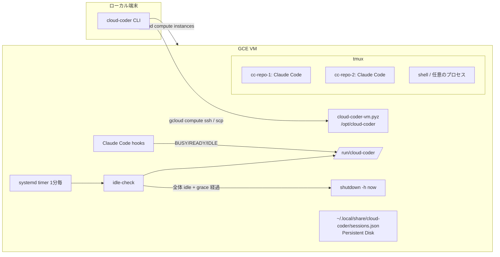

# cloud-coder

`gcloud` が使える端末から、任意の GCP project に Claude Code 専用の GCE VM を用意し、tmux 経由で操作するための CLI です。
Claude Code の hook と tmux の状態から VM 全体が idle になったことを判定し、grace period の後に VM を自動停止します。
停止しても Persistent Disk は残るので、次の `connect` で VM を起動し、同じ作業環境と Claude Code セッションに戻れます。

```bash
cloud-coder connect git@github.com:OWNER/REPO.git
```

## 仕組み



- ローカル側 (`src/cloud_coder`) は GCE の作成・起動・停止と SSH を `gcloud` で行います。依存は PyYAML のみです。
- VM 側 (`src/cloud_coder_vm`) は標準ライブラリだけで書かれ、zipapp (`cloud-coder-vm.pyz`) として配布されます。`up` / `connect` のたびにハッシュを比較し、変わっていれば scp してインストールし直します。
- `connect` は各ステップで状態を確認し、足りないものだけを用意します (VM → SSH → agent → repo → tmux → Claude Code → attach)。既存の repository を pull / reset することはありません。

## 必要なもの

- Python 3.12 以上と [uv](https://docs.astral.sh/uv/)
- [Google Cloud CLI](https://cloud.google.com/sdk/docs/install) (`gcloud auth login` 済み) と、対象 project で Compute Engine を操作できる権限
- VM へ SSH (tcp:22) できる firewall ルール。`default` network の `default-allow-ssh` があればそのまま使えます。IAP を使う場合は `35.235.240.0/20` からの tcp:22 を許可してください。
- Claude Code の Pro / Max / Team / Enterprise のいずれかのプラン (Remote Control に必要)

## インストール

```bash
uv tool install git+https://github.com/TTRSQ/cloud-coder.git
# 開発時: uv sync && uv run cloud-coder --help
```

## 使い方

```bash
cloud-coder connect git@github.com:OWNER/REPO.git   # 初回: VM 作成 → clone → tmux → Claude Code → attach
cloud-coder connect                                 # 直近のセッションへ戻る
cloud-coder connect REPO                            # REPO の直近のセッションへ戻る
cloud-coder connect REPO --new                      # REPO で別の Claude Code を git worktree 上に起動する
cloud-coder connect --session cc-REPO-2             # セッション名を指定して戻る
cloud-coder status                                  # VM / セッション / 自動停止の可否
cloud-coder stop                                    # VM を停止する (disk は残る)
cloud-coder up                                      # VM の作成・起動と agent のインストールだけ行う
```

- tmux から抜けるときは detach (`Ctrl-b d`) します。SSH が切れても tmux 内の Claude Code や他のプロセスは動き続けます。
- `connect` のオプション: `--no-attach` (attach しない)、`--no-claude` (Claude Code を起動しない)。
- private repository を SSH URL で clone する場合、`connect` はローカルの ssh-agent を VM に転送します (`ssh -A`)。鍵を agent に登録しておいてください。

### セッション

`cloud-coder` のセッションは「repository / worktree」と「Claude Code の session ID」の組で、名前はそのまま tmux session 名になります (`cc-<repo>-<n>`)。

| セッション | 作業ディレクトリ |
| --- | --- |
| `cc-<repo>-1` | `~/workspace/<repo>` (clone) |
| `cc-<repo>-N` (`--new`) | `~/workspace/<repo>.worktrees/N` (branch `cloud-coder/cc-<repo>-N` の git worktree) |

- Claude Code は `claude --session-id <uuid> --remote-control <セッション名>` で起動されます。Remote Control で claude.ai / Claude アプリからも操作できます。
- 対応表は VM の `~/.local/share/cloud-coder/sessions.json` (Persistent Disk) に保存されます。`/clear` などで Claude Code の session ID が変わると hook が対応表を更新します。
- VM の停止後に `connect` すると tmux session を作り直し、`claude --resume <session-id> --remote-control <セッション名>` で同じ会話を再開します。
- 既に Claude Code が動いているセッションへの `connect` は attach だけ行い、二重に起動しません。何かが動いている pane には入力しません。

### 初回の Claude Code 設定

初回の attach 時に Claude Code のテーマ選択と `/login` を tmux 内で行ってください。Remote Control の初回確認が出た場合も同様です。
これらは VM の `~/.claude` / `~/.claude.json` (Persistent Disk) に保存され、以後は不要です。

### workspace trust の自動承認

`cloud-coder` が自分で作るディレクトリ (`~/workspace` 配下の clone と `--new` の worktree) に限り、Claude Code 起動前に `~/.claude.json` の `projects["<dir>"].hasTrustDialogAccepted` を `true` にし、初回の trust 画面を出さないようにします ([公式 docs](https://code.claude.com/docs/en/permissions) が手動で trust する方法として示しているキーです)。
既存の内容は保持したまま、一時ファイルへの書き込みと rename で原子的に更新します。`~/workspace` の外や HOME は trust しません。
無効にする場合は config で `claude.auto_trust_workspace: false` を指定してください。

## 自動停止

VM 上の systemd timer が 1 分ごとに VM 全体を評価します。次をすべて満たすと grace period (既定 10 分) が始まり、grace period 終了時の評価でもまだ満たしていれば `shutdown -h now` します。

- 全 Claude Code セッションが `IDLE`
- tmux の全 pane がシェルのプロンプト待ち (フォアグラウンドのコマンドも、シェル配下のバックグラウンドジョブもない)

Claude Code の状態は hook で更新されます。

| イベント | 状態 |
| --- | --- |
| `SessionStart` / `UserPromptSubmit` | `BUSY` (grace period を取り消す) |
| `Stop` で `background_tasks` と `session_crons` が空 | `READY` |
| `Stop` で上記のどちらかが空でない、または欠けている | `BUSY` |
| `Notification` (`idle_prompt`) かつ `READY` | `IDLE` |
| `SessionEnd` | 状態を削除 |

- 状態は Claude Code のプロセスごとに `/run/cloud-coder/sessions/` (tmpfs) へ保存され、tmux pane とプロセス ID で実態と突き合わせます。プロセスが消えた状態ファイル (クラッシュ等で `SessionEnd` が来なかったもの) は無視して削除します。
- まだ状態を報告していない Claude Code (起動直後やログイン前) は busy 扱いです。
- `connect` も grace period を取り消します。判定と新規セッションの作成は `/run/cloud-coder/state.lock` の flock で直列化しています。
- `idle_prompt` は Claude Code が応答を終えて約 60 秒間入力が無いときに送られます。ターミナルに attach している間は送られないことがあるので、離れるときは detach してください。
- tmux の外 (SSH で直接実行したプロセスなど) は判定の対象外です。

`cloud-coder status` で、自動停止を妨げている理由と停止までの残り時間を確認できます。VM 上のログは `journalctl -u cloud-coder-idle-check.service` で見られます。

## 設定

`~/.config/cloud-coder/config.yaml` (環境変数 `CLOUD_CODER_CONFIG` か `--config` で変更可)。すべて省略可能で、既定値は以下のとおりです。

```yaml
gcp:
  project: null              # 省略時は `gcloud config get-value project`
  zone: asia-northeast1-b
  instance: cloud-coder
  machine_type: t2d-standard-8
  disk_size_gb: 100
  disk_type: pd-ssd
  image_family: ubuntu-2404-lts-amd64
  image_project: ubuntu-os-cloud
ssh:
  user: coder                # VM 上のユーザー。HOME を固定するため端末によらず同じ名前を使う
  iap: false                 # true で --tunnel-through-iap
vm:
  workspace: workspace       # HOME からの相対パス
  idle_grace_minutes: 10
  swap_gb: 0                 # 1 以上で /swapfile を作成する (既存の swapfile は変更しない)
claude:
  auto_trust_workspace: true
```

各コマンドは `--project` `--zone` `--instance` `--machine-type` `--disk-size-gb` `--disk-type` `--iap/--no-iap` で上書きできます。
machine type / disk は VM 作成時に使われます。既存 VM に `--machine-type` を指定した場合、VM が停止中なら `set-machine-type` で変更してから起動します。

作成される VM には `cloud-coder=worker` のラベルが付き、SSH 鍵は project ではなくこの VM の metadata にだけ追加されます (`block-project-ssh-keys`)。VM には service account を付けません。

## マシンタイプの目安

Claude Code の推論はクラウド側で行われるので、VM のスペックは test / build / typecheck / language server / Docker / package install など、Claude Code と subagent が VM 上で動かす処理のために必要です。

| 構成 | machine type | vCPU / メモリ | 用途 |
| --- | --- | --- | --- |
| minimum | `e2-standard-4` | 4 / 16 GB | Claude Code 1 セッション、subagent 少数。安くメモリと並列度を確保したいとき |
| **recommended (既定)** | **`t2d-standard-8`** | 8 / 32 GB | 複数 subagent・複数セッション、一般的な Web / backend 開発、test / build の並列実行 |
| 低コストの代替 | `e2-standard-8` | 8 / 32 GB | recommended と同じ規模で費用を抑えたいとき。CPU 世代は選べず 1 コアは遅め |
| heavy | `n2-standard-16` / `t2d-standard-16` | 16 / 64 GB | 大規模 monorepo、重い Docker build、大量の test、多数のセッション |

- 長い replay や単一プロセスの test など、1 コアの速さが効く処理が多いなら t2d (AMD EPYC、SMT なし) など新しい世代の専有 vCPU を選んでください。t2d-standard-4 は 1 コア性能あたりの価格が最も良い選択肢の一つです。
- `e2-medium` などの shared-core は複数 subagent の用途に使わないでください。持続的には約 1 vCPU しか使えず、steal で速度も不安定になり (同じ benchmark が 2.3 倍ぶれた例があります)、メモリ 4 GB では並列 test で OOM の危険があります (#6)。
- disk は既定で 100 GB の SSD Persistent Disk です。`node_modules` や Docker layer で I/O が多いため SSD を推奨します。
- 自動停止があるので、小さい VM を常時起動するより、必要な時だけ大きめの VM を起動する方が快適で、費用も抑えやすくなります。
- 価格は region によって変わります。[GCP 料金計算ツール](https://cloud.google.com/products/calculator)で確認してください。
- 既定値の定義は `src/cloud_coder/config.py` の `DEFAULT_MACHINE_TYPE` の 1 箇所です。

## 小さい VM で複数 agent を動かすときの運用

VM が小さい場合や、多数の subagent が同時に重い処理を走らせる場合に効果があった運用です (#6)。

- 重い処理 (test 全体、build、大きなダウンロード) は共有 lock で直列化する。

  ```bash
  flock ~/workspace/.heavy.lock uv run pytest
  ```

- ローカル (VM) では変更に関係する test だけを走らせ、全体は CI に任せる (`gh pr checks --watch` で待つ)。
- 長時間のダウンロードは `nice` で優先度を下げる。
- 実装を行う agent は同時に 1 つに絞り、一時停止した agent が残した polling ループなどの孤児プロセスは kill する。
- `/tmp` が tmpfs の場合、残った pytest の basetemp などを掃除する。
- メモリが少ない VM では `vm.swap_gb: 4` などで swapfile を作り、OOM kill の代わりに遅くなるだけにする。

## 開発

```bash
uv sync
uv run ruff check . && uv run ruff format --check .
uv run pytest tests/unit
```

`tests/e2e` は実際の GCP project に VM を作る end-to-end テストです (既定では skip)。

```bash
CLOUD_CODER_E2E_PROJECT=<project> uv run pytest tests/e2e --run-e2e -v
```

GitHub Actions の `E2E (real GCP)` workflow (手動実行) は Workload Identity Federation で認証します。repository variables `GCP_WORKLOAD_IDENTITY_PROVIDER` / `GCP_SERVICE_ACCOUNT` / `CLOUD_CODER_E2E_PROJECT` を設定してください。

### Manual verification

ログイン済みの Claude Code が必要な項目は自動テストできないため、次の手順で確認します。

1. `cloud-coder connect <repo>` で attach し、テーマ選択と `/login` を済ませる。trust 画面が出ないこと、`/rc active` (Remote Control) が表示されることを確認する。
2. Claude Code に何か作業をさせ、終わったら `cloud-coder status` で `READY` になっていることを確認する。detach して約 1 分後に `IDLE` になり、grace period が始まることを確認する。
3. grace period 経過後に VM が停止すること (`cloud-coder status` が `stopped`) を確認する。
4. `cloud-coder connect` で VM が起動し、`claude --resume` で同じ会話に戻ること、Remote Control が再開することを確認する。
