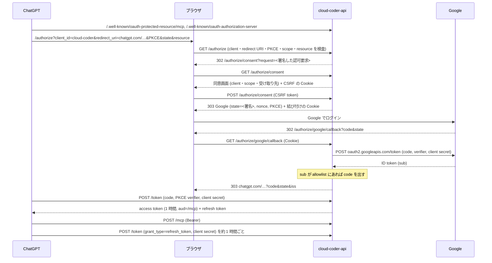

# /mcp の OAuth の設計

ChatGPT のカスタム MCP (developer mode のアプリ) から、Cloud Run の `cloud-coder-api` の `/mcp` を長時間 (再ログインなしで 1 時間超) 安全に使うための認証・認可の設計です。対象 issue は #33 と、親 issue #31 の #27〜#30 です。運用手順 (構築・ローテーション・停止・ロールバック) は [infra/README.md](../infra/README.md)、使い方は [README の HTTP API](../README.md#http-api) と [how-to-use の ChatGPT から使う](../how-to-use.md#chatgpt-から使う) にあります。

## 守るもの

`/mcp` の access token は VM のシェルと同等の権限を持ちます (VM の起動・停止、任意の repository の clone、Claude Code へのプロンプト)。利用者は 1 人、クライアントは ChatGPT だけです。

想定する攻撃:

- **同意フィッシング** (#31): 攻撃者が自分の ChatGPT にこの URL を登録し、認可の URL を本人に送る。ChatGPT の redirect URI は全利用者で共通なので、redirect URI の制限だけでは防げない。
- ChatGPT 側に保存された token の漏えい、ログへの秘密の混入、署名鍵の漏えい、Google アカウントの乗っ取り。
- CSRF・clickjacking・open redirect・state / code の改ざんと再利用。

## 採用した構成

**自前の authorization server (AS) が自分の token を出す。Google は承認者の本人確認 (OpenID Connect) にだけ使う。client は事前登録した 1 つだけ (Dynamic Client Registration は無効)。**



- **client**: `client_id=cloud-coder`、client secret は Secret `cloud-coder-api-oauth-client-secret`、`token_endpoint_auth_method=client_secret_post`、redirect URI は `https://chatgpt.com/connector_platform_oauth_redirect` だけ。ChatGPT のアプリ作成画面で client ID と secret を入力する (OpenAI の文書の "predefined OAuth client")。
- **承認**: 同意画面で「Continue with Google」→ Google でログイン → ID token の `sub` が allowlist (`CLOUD_CODER_OAUTH_ALLOWED_SUBS`) にあれば code を出す。
- **token**: 何も保存しない。認可要求・Google の `state`・code・access token・refresh token は、claims に HMAC-SHA256 を付けた自己完結の値。鍵は Secret `cloud-coder-api-oauth-signing-keys` (カンマ区切り、先頭で署名・全部で検証) から種類ごとに HKDF で導出する。
- **grant の寿命**: access token 1 時間、refresh token は使われないと 14 日で失効、grant 全体は承認から 30 日 (`auth_time` を引き継ぎ、どれだけ refresh しても延びない)。その後は ChatGPT で接続し直す。
- **取り消し**: `sub` を allowlist から外すと、その人の grant (code・access・refresh) がすぐ無効になる。署名鍵を全部入れ替えると全 grant が無効になる。client secret を入れ替えると ChatGPT の refresh も code の交換もできなくなる。
- `/mcp` は、この AS が出した `aud=<公開 URL>/mcp` の access token だけを受け付ける。静的な Bearer token (旧 read / write token) と Google の token は受け付けない。

### 比較した案

| 観点 | A: Google の token を中継 (Trillion OS #360) | B: 自前 AS + Google で本人確認 (DCR あり) | **B+: B + 事前登録の confidential client (採用)** |
| --- | --- | --- | --- |
| 同意フィッシング | Google の client secret を知らない攻撃者は code を交換できない | 攻撃者の ChatGPT が DCR で自分の client を作れる。同意画面の注意書きだけが頼り | 攻撃者の ChatGPT には client secret が無く、code を交換できない。加えて承認には allowlist の Google アカウントが要る |
| refresh token の漏えい | Google の refresh token。寿命は Google が決め (6 か月未使用・取り消しまで)、こちらで絶対期限を付けられない | 自前の refresh token。絶対期限と allowlist で止まる | B に加え、client secret なしでは使えない (RFC 9700 4.14: confidential client の refresh token はその client しか使えない) |
| 1 時間超の継続 | Google が refresh token を出す条件 (`access_type=offline`・`prompt=consent`)、1 client あたり 100 個の上限、Workspace のセッション制御に左右される。`/mcp` の呼び出しごとに tokeninfo | Google は承認時だけ。refresh は自前の `/token` で、ログで確かめられる | 同左 |
| 仕様との整合 | Google の token の `aud` は Google の client ID で、RFC 8707 の resource に結び付かない。`iss` を合わせるため callback の中継が要る | `aud=/mcp`、自前の `iss` (RFC 9207)。ただし public client の refresh token のローテーション (MCP の MUST) を満たさない | public client ではないので、ローテーションの要件は当たらない |
| 自分で持つ認証コード | state・callback・token の中継・tokeninfo。既存の AS は捨てる | 既存の AS に Google ログインを足す | B から DCR を外す |

C (Auth0 などの外部 AS) は #31 で不採用 (利用者 1 人・クライアント ChatGPT のみには過剰)。mTLS (OpenAI のクライアント証明書) は認証の代わりではなく追加の層で、#31 の「保留」のまま。

同じ問題を解く OSS も B の形です。FastMCP の OAuthProxy は自分の JWT を出して upstream の token をクライアントに渡さず、フローごとに同意画面と署名済みの Cookie によるブラウザの結び付けを行います (https://gofastmcp.com/servers/auth/oauth-proxy)。Cloudflare の workers-oauth-provider は Worker 自身が AS で、GitHub / Google はログインの手段として使い、自分の token を出します (https://github.com/cloudflare/workers-oauth-provider、https://developers.cloudflare.com/agents/model-context-protocol/authorization/)。

## 現状の観測 (2026-10-09、Cloud Run のリクエストログ)

旧構成 (write token で承認) の ChatGPT の接続について、`gcloud logging read` で `/authorize`・`/register`・`/token` のリクエストを見た (値は記録していない)。

- **事実**: 2026-10-05 07:31 (UTC) の 1 回の承認 (`/authorize` → `/authorize/approve` → `/token`) の後、10-09 02:48 まで `/authorize` は無く、`POST /token` が 200 で約 1 時間ごとに続いている。1 時間以上空いた後の `/token` も 200 (例: 10-07 14:53 → 10-08 01:21)。
- **推論**: これらの `/token` は refresh grant (旧構成の `/token` は authorization_code と refresh_token しか受けず、`/authorize` が無い以上 code は無い)。ChatGPT は access token の期限 (1 時間) 前後で refresh し、無操作の後も再ログインなしで続いている。**grant_type はログに無いので refresh grant の直接の証拠ではない。** この PR から `/token` で `OAuth: refreshed a grant approved Nh ago` をログに出す。
- **事実**: ChatGPT が送った `redirect_uri` は `https://chatgpt.com/connector_platform_oauth_redirect`、`scope` は `read write offline_access`、`resource` は `<公開 URL>/mcp`。

つまり #33 の「1 時間超」は旧構成でも実質的に満たされていて、この PR の主眼は承認と grant の強化 (#27〜#30) です。

## Trillion OS の履歴から変えたこと

| Trillion OS の失敗・教訓 | この設計 |
| --- | --- |
| #352: Google を AS にすると refresh token が出るかは Google と ChatGPT 次第 (`access_type=offline` が付かない) | refresh token は自分で出す。Google の refresh token は要求しない (`access_type` を付けない) |
| #355: 認可だけを中継すると `iss` が Google のものになり、ChatGPT が `/connector/oauth/{callback_id}` を使い出して 400 | 自分が AS なので `iss` は常に自分。`authorization_response_iss_parameter_supported: true` で ChatGPT は固定の redirect URI を使う。それ以外の redirect URI は受け付けない (#30) |
| #357: callback_id ごとに Google Cloud へ redirect URI を登録する運用 | Google に登録する redirect URI は `<公開 URL>/authorize/google/callback` の 1 つだけ |
| #360: state の HMAC 署名・10 分・Cookie の照合と消去、パラメータのホワイトリスト、grant の限定、no-store、ログに秘密を出さない | 同じ (下のチェックリスト)。加えて Google の PKCE・nonce・同意画面の CSRF |
| #360: 同意フィッシングを止めているのは client secret の秘匿だけ | 事前登録の confidential client で同じ性質を持たせ、加えて allowlist の `sub` を要求する |
| #354: 利用できた事実と refresh grant の実行を分けて記録できなかった | `/token` の refresh をログに出し、実機確認の手順で両方を記録する |

## ベストプラクティスとの照合

| 項目 | 出典 | この設計 |
| --- | --- | --- |
| resource server は自分宛ての token だけを受け付け、それ以外を通さない (audience、token passthrough の禁止) | MCP Authorization 2025-11-25 "Token Handling" / "Access Token Privilege Restriction" https://modelcontextprotocol.io/specification/2025-11-25/basic/authorization | `aud=<公開 URL>/mcp` の自前の access token だけ。静的 token と Google の token は 401 (テストで確認) (#27) |
| Protected Resource Metadata (RFC 9728)、401 の `WWW-Authenticate` に `resource_metadata` | 同上、https://datatracker.ietf.org/doc/html/rfc9728 | MCP SDK が提供 (テストで確認) |
| AS Metadata (RFC 8414)、`code_challenge_methods_supported` | 同上、https://datatracker.ietf.org/doc/html/rfc8414 | `issuer` は公開 URL そのもの (末尾 `/` なし)、`S256` のみ、`registration_endpoint` なし、`token_endpoint_auth_methods_supported: [client_secret_post]` |
| PKCE S256 必須 | RFC 9700 2.1.1 https://www.rfc-editor.org/rfc/rfc9700.html、MCP "Authorization Code Protection" | ChatGPT との間は SDK が S256 を強制。Google との間もこちらが S256 の verifier を持つ |
| redirect URI の完全一致、不正な組み合わせでは redirect しない | RFC 9700 4.1.3 / 4.11.2、MCP "Open Redirection" | 登録 URI との完全一致 (ワイルドカード廃止、#30)。不一致・未知の client は 400 で redirect しない (テストで確認) |
| open redirector を作らない | RFC 9700 2.1、OWASP OAuth2 Cheat Sheet https://cheatsheetseries.owasp.org/cheatsheets/OAuth2_Cheat_Sheet.html | Google の callback の戻り先は署名した認可要求の中の値だけ (SDK が登録 URI と照合済み)。Google への転送先は固定の URL |
| mix-up 対策: 認可応答に `iss` (RFC 9207) | RFC 9207 https://www.rfc-editor.org/rfc/rfc9207.html、OpenAI https://developers.openai.com/plugins/build/auth | 成功・エラー (access_denied) の両方の応答に `iss` を付ける |
| public client の refresh token はローテーションか sender-constrained | MCP "Token Theft"、RFC 9700 2.2.2 / 4.14 | 事前登録の confidential client。refresh には client secret が要る (RFC 9700 4.14: confidential client の refresh token はその client しか使えない)。**意図した逸脱**: ローテーション (使用済み refresh token の失効) はしない。状態を持たない設計を保つため。個別取り消しと合わせて #39 で追う |
| refresh token は使われないと失効させる | RFC 9700 4.14 | 最後の発行から 14 日で失効 (`REFRESH_TOKEN_TTL`) |
| 絶対期限 | Auth0 "Maximum lifetime" https://auth0.com/docs/secure/tokens/refresh-tokens/configure-refresh-token-expiration、#29 | 承認から 30 日 (`GRANT_LIFETIME`)。access token の期限もこれを超えない |
| 最小権限の scope、要求された scope を尊重 | MCP "Scope Minimization" https://modelcontextprotocol.io/specification/2025-11-25/basic/security_best_practices | 付与 = 要求 ∩ {read, write, offline_access}、要求が無ければ read + write。refresh では広げられない (#29) |
| proxy の confused deputy: client ごとの同意、同意画面に client 名・scope・redirect URI、CSRF、frame 禁止 | MCP Security Best Practices "Confused Deputy Problem" | client は 1 つだけで DCR なし (前提条件そのものが無い)。それでも同意画面を毎回出し、client・scope・受け取り先を表示、CSRF token、`frame-ancestors 'none'` と `X-Frame-Options: DENY` |
| state の Cookie は同意の**後**、upstream へ redirect する直前に置く。1 回限り・短命 | 同上 "OAuth State Parameter Validation" | 同意画面の GET で置く Cookie は CSRF token の種だけ。同意の POST で新しい値に置き換え、Google の `state` にはその MAC を入れる。callback で照合して消し、さらにメモリ上で 1 回限り。10 分 |
| Cookie は `__Host-`、`Secure`、`HttpOnly`、`SameSite=Lax`、署名 | 同上、OWASP Session Management https://cheatsheetseries.owasp.org/cheatsheets/Session_Management_Cheat_Sheet.html | `__Host-cloud-coder-oauth`、`Path=/`、`Domain` なし、`Max-Age=600`。値は乱数で、検証は署名鍵による MAC |
| clickjacking | OWASP Clickjacking https://cheatsheetseries.owasp.org/cheatsheets/Clickjacking_Defense_Cheat_Sheet.html | CSP `frame-ancestors 'none'` + `X-Frame-Options: DENY` |
| 機微な応答のキャッシュ禁止 | OWASP Session Management、MCP | 同意画面・redirect・`/token` に `Cache-Control: no-store` (redirect と画面には `Pragma: no-cache`・`Referrer-Policy: no-referrer` も) |
| Google: `state` と `nonce` を使い、`sub` で利用者を識別 (メールは使わない) | Google OpenID Connect https://developers.google.com/identity/openid-connect/openid-connect、OpenAI https://developers.openai.com/plugins/build/auth | `state` は署名・期限・Cookie の結び付け、`nonce` と Google の PKCE verifier は Cookie の値から導出 (URL の `state` を見ても計算できない)。allowlist は `sub` |
| ID token の検証 (`iss`・`aud`・`azp`・`exp`・`nonce`) | OIDC Core 3.1.3.7 https://openid.net/specs/openid-connect-core-1_0.html | すべて照合。**署名 (JWKS) は検証しない**: ID token は Google の token endpoint から TLS で直接、client secret と引き換えに受け取るので、OIDC Core 3.1.3.7 の手順 6 が署名の代わりに TLS の検証を認めている。Google も直接受け取った token は Google から来たと信頼できるとしている。JWKS の取得・キャッシュ・鍵の更新という動く部分を増やさないための判断で、#28 の「署名」からの逸脱 |
| Google へ送るパラメータはホワイトリストで組み立てる | trillion-os #360 | 認可 URL と token 要求のパラメータを固定の集合で組み立てる (テストで集合を完全一致で確認) |
| 秘密をログ・エラーに出さない | MCP "Token Theft"、#33 | ログには事象の区分だけ (Google のエラーは `[a-z_]` の error コードだけ)。設定の `repr` に秘密を出さない。テストで、各種の秘密の値がログに無いことを確認 |
| 署名鍵のローテーション | — | 複数の鍵を受け付け、先頭で署名・全部で検証。refresh すると新しい鍵で署名し直すので、鍵を足して 30 日 (grant の寿命) 待てば古い鍵を外せる。kid は付けない (クライアントには不透明な HMAC の値で、検証は高々数個の鍵を順に試すだけ) |
| client secret・署名鍵の強度と保管 | RFC 6749 10.10 https://www.rfc-editor.org/rfc/rfc6749#section-10.10 | どちらも 32 文字以上でないと起動しない (`openssl rand -base64 32` などで作る)。Secret Manager に入れ、Terraform の state には入れない |
| client 認証は非対称の方式が望ましい | OWASP OAuth2 Cheat Sheet | **意図した逸脱**: ChatGPT が事前登録の client で使えるのは client secret の方式なので `client_secret_post` |
| access token の sender-constraint (DPoP / mTLS) | OWASP OAuth2 Cheat Sheet、RFC 9700 | **未対応**: ChatGPT は DPoP を送らない。mTLS は #31 の保留事項 |

## issue との対応

| issue | この PR | 内容 |
| --- | --- | --- |
| #27 | Closes | `/mcp` は自前の access token だけ。read / write token と Secret を廃止 |
| #28 | Closes | Google ログイン + `sub` の allowlist で承認。署名鍵を専用の Secret に。write token・global lockout を廃止 |
| #29 | Closes (必須部分) | grant の絶対期限 (30 日)、要求 scope の尊重。任意部分 (Firestore によるローテーション・個別取り消し・`/revoke`) は #39 |
| #30 | Closes | redirect URI は `connector_platform_oauth_redirect` の 1 本 (完全一致) |
| #31 | Refs | 受入条件のうち、デプロイと ChatGPT のつなぎ直しが残る |
| #33 | Refs | 実機での 60〜90 分無操作と翌日の確認が残る (下の手順) |

#28〜#30 と DCR の廃止はどれも既存の接続を無効にするので、1 つのリリースにまとめ、ChatGPT のつなぎ直しは 1 回で済ませます。

## 残るリスク

- ChatGPT 側が丸ごと漏れると、refresh token と client secret が一緒に漏れる。止めるのは allowlist から外す・client secret の入れ替え・grant の寿命 (30 日)。
- Google アカウントが乗っ取られると、新しい grant を承認できる。Google の 2 段階認証 (passkey) を使う。
- 署名鍵が漏れると token を偽造できる。鍵を入れ替えると全 grant が無効になる ([infra/README.md](../infra/README.md))。
- Cloud Run のリクエストログに、Google の callback の URL (Google の code と `state`) が残る。code は 1 回限りで、交換には PKCE の verifier (Cookie の値から導出) と Google の client secret が要る。
- refresh token をローテーションしないので、漏れた refresh token は期限 (最長 14 日・grant の寿命まで) か取り消しまで使える。
- ChatGPT がいつ refresh するかは OpenAI の文書に無い。上の観測は旧構成でのもの。

## 実機での確認手順 (#33)

デプロイと ChatGPT の接続のやり直しの後に行う。時刻と HTTP の結果だけを記録し、token・code・state の値は記録しない。

1. 接続: ChatGPT でアプリを作り直し (client ID / secret を入力)、同意画面 → Google → ChatGPT に戻る。会話で `status` を呼ぶ。
2. ログで承認と交換を確かめる:
   ```bash
   gcloud logging read 'resource.labels.service_name="cloud-coder-api" AND textPayload:"OAuth:"' \
     --project <project> --freshness=1d --format='value(timestamp,textPayload)'
   ```
   `OAuth: approved a grant`・`OAuth: exchanged an authorization code` が出る。
3. 60〜90 分、ChatGPT から何も呼ばずに置く。その後、再接続せずに `status` を呼ぶ。成功したか (時刻) を記録する。
4. 同じログで、3 の前後に `OAuth: refreshed a grant approved Nh ago` があるかを見る。**「使えた」と「refresh grant が実行された」を分けて記録する**。
5. 可能なら翌日にもう一度 3〜4。
6. 結果を #33 に書き、満たしていれば閉じる。
