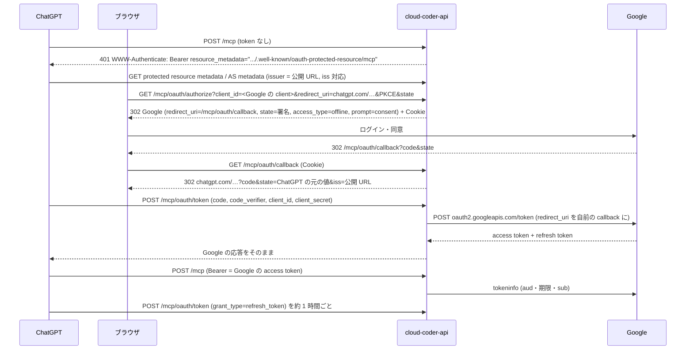

# /mcp の OAuth の設計

ChatGPT のカスタム MCP (developer mode のアプリ) から、Cloud Run の `cloud-coder-api` の `/mcp` を長時間 (再ログインなしで 1 時間超) 使うための認証の設計です。対象は issue #33 です。構成は Trillion OS の目標 MCP の最終形 (AOI-Inc/trillion-os#360、`docs/MCP目標管理.md`) に合わせます。運用手順 (構築・停止・ロールバック) は [infra/README.md](../infra/README.md)、使い方は [README の HTTP API](../README.md#http-api) と [how-to-use の ChatGPT から使う](../how-to-use.md#chatgpt-から使う) にあります。

## 前の構成 (PR #40) で起きたこと

PR #40 では、自前の authorization server (AS) が自前の token を出し、Google は承認者の本人確認にだけ使っていました。scope は `read` / `write` / `offline_access` で、refresh token は `offline_access` を含む grant にだけ出していました。

2026-10-09 のデプロイ後の Cloud Run のリクエストログ (値は記録していない):

- **事実**: ChatGPT の認可要求は `scope=read` だけだった (05:35〜06:53 UTC の 5 回すべて)。当時の protected resource metadata の `scopes_supported` は `["read"]` (`/mcp` の required scope) だけで、ChatGPT はそこから scope を選んだと考えられる (推論)。
- **結果**: grant は `read` だけになり、`offline_access` が無いので refresh token も出なかった。書き込みの tool (`up` / `start_session` / `send_prompt` / `stop`) は使えず、05:43 の接続の約 70 分後 (06:53) に、ChatGPT は認可 (`/authorize` → 同意画面 → Google) をやり直した。#33 の「1 時間超、再認証なし」を満たさない。

自前の scope と refresh token の条件は、ChatGPT がどの scope を要求するかに左右されます。Trillion OS の最終形は、scope を OIDC の `openid email` に固定し、refresh token を Google に必ず出させます。そのため、この問題が起きません。

## 採用した構成: Google の OAuth の中継 (Trillion OS の最終形)

**ログイン・同意・token の発行と更新は Google が行う。API は、ChatGPT に見せる AS として認可・コールバック・トークンの 3 つのエンドポイントを持ち、Google へ中継する。`/mcp` は Google の access token を tokeninfo で確かめる。何も保存しない。**



- **なぜ 3 つとも中継するか** (Trillion OS #352→#355→#357→#360 の結論):
  - Google は `access_type=offline` があるときだけ refresh token を出し、ChatGPT はこれを付けない。そこで認可エンドポイントを自前にして足す。`prompt=consent` は 2 回目以降の認可でも refresh token を出させるため (https://developers.google.com/identity/protocols/oauth2/web-server#offline)。
  - 認可だけを中継すると、Google がコールバックに付ける `iss` が自前の issuer と合わない。ChatGPT は、AS が RFC 9207 の issuer identification を満たすときだけ固定の `https://chatgpt.com/connector_platform_oauth_redirect` を使い、満たさなければコネクタごとの `https://chatgpt.com/connector/oauth/{callback_id}` を使う (https://developers.openai.com/apps-sdk/build/auth)。後者は Google の client へコネクタごとに登録が要る。
  - コールバックを自前で受けて自前の `iss` を付ければ、Google に登録する redirect URI は自前の callback 1 つで済む。Google は code を自前の callback 宛てに出すので、トークンの交換でも同じ redirect URI を渡す必要があり、トークンエンドポイントも中継する。
- **client**: Google の OAuth client そのもの。ChatGPT にその client ID と secret を入力する (ユーザー定義の OAuth client、`client_secret_post`)。API は secret を持たず、正しいかは Google が確かめる。Dynamic Client Registration は無い。
- **scope**: `openid email` だけ (AS metadata・protected resource metadata の `scopes_supported`)。OpenAI の文書では、AS metadata に `openid` や `email` があれば ChatGPT は既定でそれを要求する (同上)。Google の他の API の権限は求めない。
- **`/mcp` の認可**: Google の tokeninfo に access token を POST し (URL に token を載せない)、`aud` が Google の client ID、期限内、`sub` が allowlist (`CLOUD_CODER_OAUTH_ALLOWED_SUBS`) にあるときだけ通す。結果は最長 60 秒 (かつ token の期限まで) 使い回す。通った token ではすべての tool を呼べる。
- **state**: ChatGPT の `state` と、この認可の ID と期限 (10 分) を、署名鍵から用途ごとに派生させた鍵の HMAC-SHA256 で署名する。認可を始めたブラウザには、ID ごとの Cookie (`__Secure-cloud-coder-oauth-<ID>`、値は ID の HMAC、`Path=/mcp/oauth/callback; HttpOnly; Secure; SameSite=Lax`) を置き、callback で照合して消す。

### Trillion OS との違い

| Trillion OS | cloud-coder | 理由 |
| --- | --- | --- |
| tokeninfo の確認済みメールで User を DB から引き、ロールと目標の権限で決める | tokeninfo の `sub` を allowlist と照らす | 利用者は 1 人で、User の DB が無い。前の構成の allowlist (`oauth_allowed_subs`) をそのまま使う。allowlist が無いと、この Google の client で認可した Google アカウントなら誰でも VM を操作できる |
| エンドポイントは `/api/mcp/oauth/{authorize,callback,token}` | `/mcp/oauth/{authorize,callback,token}` | MCP の path (`/mcp`) の下に置く形を揃えた |
| redirect URI は固定のものと `connector/oauth/{callback_id}` の正規形 | 固定の `connector_platform_oauth_redirect` だけ | callback_id 付きは、RFC 9207 を満たす前に作ったコネクタのため。cloud-coder にそのコネクタは無い (2026-10-09 のログでは固定の URI だった) |
| クライアント認証は `client_secret_post` と `client_secret_basic` | `client_secret_post` だけ | ChatGPT で使っている方式だけにした |
| state の鍵は `AUTH_SECRET` から派生 | 既存の Secret `cloud-coder-api-oauth-signing-keys` から派生 | cloud-coder に `AUTH_SECRET` は無い |
| Google に届かないとき `/mcp` は 503 | 500 | MCP SDK の bearer 認証の中で検証するため、例外は 500 になる。どちらも 401 ではない (ChatGPT を再ログインに送らない) |

## 守っていること

| 項目 | 出典 | この設計 |
| --- | --- | --- |
| Protected Resource Metadata、401 に `resource_metadata` | RFC 9728 https://datatracker.ietf.org/doc/html/rfc9728、MCP Authorization https://modelcontextprotocol.io/specification/2025-11-25/basic/authorization | MCP SDK が提供。`authorization_servers` は issuer (公開 URL) |
| AS Metadata | RFC 8414 https://datatracker.ietf.org/doc/html/rfc8414 | `issuer` は公開 URL そのもの (末尾 `/` なし)、`S256` のみ、`authorization_response_iss_parameter_supported: true` |
| 認可応答に `iss` | RFC 9207 https://www.rfc-editor.org/rfc/rfc9207.html、OpenAI (上) | callback から ChatGPT へ戻す応答 (成功・Google のエラー) に必ず付ける。検証できない要求は redirect せず 400 |
| PKCE S256 | RFC 9700 https://www.rfc-editor.org/rfc/rfc9700.html | `/mcp/oauth/authorize` で S256 を要求し、challenge を Google へ渡す。verifier は Google が確かめる |
| redirect URI の完全一致、open redirector を作らない | RFC 9700 4.1 / 4.11 | ChatGPT の固定の URI と完全一致。転送先は固定 (Google の認可 / token endpoint、ChatGPT の URI) で、リクエストから決めない |
| state の改ざん・期限切れ・別ブラウザ・再利用を断る | MCP Security Best Practices https://modelcontextprotocol.io/specification/2025-11-25/basic/security_best_practices、trillion-os#360 | 署名・10 分・Cookie の照合。Cookie は使ったら消す |
| Google へ送るパラメータを固定の集合で組み立てる | trillion-os#360 | 認可も token も、決まったパラメータだけ (テストで集合を完全一致で確認)。`grant_type` は `authorization_code` と `refresh_token` だけ |
| token は自分宛てのものだけ受け付ける | MCP Authorization "Token Handling" | tokeninfo の `aud` が自分の Google の client。userinfo だけでは確かめない (別のアプリ宛ての token が通るため) |
| 機微な応答のキャッシュ禁止 | OWASP https://cheatsheetseries.owasp.org/cheatsheets/OAuth2_Cheat_Sheet.html | 3 つのエンドポイントの応答に `Cache-Control: no-store`。callback の redirect に `Referrer-Policy: no-referrer` |
| 秘密をログに出さない | #33 | ログは事象の区分だけ (Google のエラーは `[a-z_]` の error コードだけ)。テストで client secret・code・verifier・token・state が無いことを確認 |

## 残るリスク

- **refresh token は長期の資格情報として ChatGPT (OpenAI) に渡る。** Google の client secret (これも ChatGPT が持つ) と組み合わせると、取り消すまで access token を出し続けられる。寿命は Google が決める (取り消すまで、6 か月使われないまで、1 アカウント・1 client あたり 100 個を超えて古いものから。https://developers.google.com/identity/protocols/oauth2#expiration)。止め方は [infra/README.md](../infra/README.md#止める取り消す)。
- **他人のコネクタへの code の受け渡し。** ChatGPT の固定の redirect URI は全利用者で共通なので、第三者が自分のコネクタ宛ての認可 URL を踏ませると、code はそのコネクタへ渡りうる。code を token に換えるのを止めているのは Google の client secret の秘匿と、Google の同意画面 (`prompt=consent` で毎回出る) だけ。さらに `/mcp` は allowlist の `sub` を要求するが、踏んだのが本人なら `sub` は通る。secret は ChatGPT のアプリに入れる人だけが持つ。
- **code・secret・token がこのサーバを通る** (メモリ上だけ。保存・ログ出力はしない)。Cloud Run のアクセスログには callback の URL (1 回限りの Google の code と `state`) が残る。
- **tokeninfo への依存。** `/mcp` を呼ぶたびに (60 秒のキャッシュを除き) Google に問い合わせる。Google で取り消した token は最長 60 秒通る。無効な token を大量に送られると Google のレート制限にかかりうる (推論)。
- **Google の id_token の `iss` は Google のもの。** token の応答はそのまま返すので、ChatGPT が id_token の `iss` を自前の issuer と比べると失敗しうる (未確認。Trillion OS では 2026-10-08 に接続でき、約 87 分後も tool を呼べた。trillion-os#354)。
- **読み取り専用の接続は作れない。** Google には独自の scope を要求できないので、tool の出し分けをしない。

## 実機での確認手順

デプロイと ChatGPT の接続のやり直しの後に行う。時刻と HTTP の結果だけを記録し、token・code・state の値は記録しない。

1. ChatGPT でアプリを作り直し (Google の client の ID / secret)、Google でログインして ChatGPT に戻る。Google の画面の URL に `access_type=offline`・`prompt=consent`・`redirect_uri=<公開 URL>/mcp/oauth/callback` があることを見る。
2. 会話で `status` を呼ぶ。続けて書き込みの tool (例: `up`) が使えることも確かめる。
3. ログを見る:
   ```bash
   gcloud logging read 'resource.labels.service_name="cloud-coder-api" AND textPayload:"OAuth:"' \
     --project <project> --freshness=1d --format='value(timestamp,textPayload)'
   ```
   `OAuth: Google granted tokens (authorization_code)` が出る。
4. 60〜90 分、ChatGPT から何も呼ばずに置く。その後、再接続せずに `status` を呼ぶ。成功したか (時刻) を記録する。
5. 同じログで、4 の前後に `OAuth: Google granted tokens (refresh_token)` があるか、`/mcp/oauth/authorize` へのリクエストが無いかを見る。**「使えた」と「refresh grant が実行された」を分けて記録する。**
6. 可能なら翌日にもう一度 4〜5。結果を #33 に書く。
