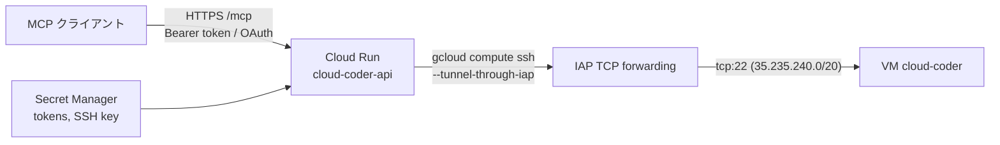

# infra: HTTP API を Cloud Run で動かす

`cloud-coder api` ([HTTP API](../README.md#http-api)。MCP over HTTP) を Cloud Run に置き、ChatGPT などの MCP クライアントから VM を操作できるようにする Terraform です。リポジトリ直下の `Dockerfile` が API のイメージです。



## 作るもの

| リソース | 内容 |
| --- | --- |
| `google_cloud_run_v2_service.api` | `cloud-coder-api`。最小 0 / 最大 1 インスタンス、リクエストタイムアウト 600 秒。**`allUsers` に `roles/run.invoker` を付けて公開**し、アプリの Bearer token と、write token で承認した OAuth grant だけで守る。環境変数 `CLOUD_CODER_PUBLIC_URL` に公開 URL (変数 `public_url`、既定は `https://cloud-coder-api-<project number>.<region>.run.app`。OAuth の issuer) を渡す |
| `google_service_account.api` | `cloud-coder-api`。API の実行 SA |
| `google_project_iam_custom_role.vm_operator` | `compute.instances.get/start/stop/resume/setMetadata`。**VM 1 台にだけ**付与 |
| `google_project_iam_custom_role.project_reader` | `compute.projects.get` だけ。`gcloud compute ssh` が project を読むため project に付与 (追加のみの `_iam_member`) |
| `google_iap_tunnel_instance_iam_member.api_ssh` | VM 1 台への IAP トンネル (`roles/iap.tunnelResourceAccessor`) |
| `google_compute_firewall.iap_ssh` | `cloud-coder-allow-iap-ssh`。IAP の範囲 (35.235.240.0/20) から network tag `cloud-coder` の VM への tcp:22 を許可 (優先度 1000) |
| `google_compute_firewall.deny_other_ssh` | `cloud-coder-deny-other-ssh`。それ以外 (0.0.0.0/0) から network tag `cloud-coder` の VM への tcp:22 を拒否 (優先度 1001)。`default-allow-ssh` (優先度 65534) などの許可より先に効き、IAP の許可より後に評価されるので、VM には IAP 経由でしか SSH できない。他の VM には影響しない |
| `google_artifact_registry_repository.api` | `cloud-coder` (Docker)。最新 3 バージョンは残し、それ以外で 30 日を過ぎたイメージを消す |
| `google_secret_manager_secret.api` | `cloud-coder-api-read-tokens` / `-write-tokens` / `-ssh-key` の入れ物。値は gcloud で入れる |
| `google_project_service.this` | 使う API を有効化する。destroy しても無効化しない |

- VM は cloud-coder が作成・起動・停止するので Terraform では管理せず、data source で読むだけです。cloud-coder が作る VM には network tag `cloud-coder` が付きます。それより前に作った VM には `gcloud compute instances add-tags <instance> --tags=cloud-coder --zone=<zone>` で付けてください。
- 他の用途と共有している project でも使えるように、Terraform はここに書いたリソースだけを持ちます。`default` network、`default-*` の firewall ルール、project の IAM policy 全体には触りません。
- secret の値 (token、SSH 秘密鍵) は Terraform の state に入れません。Terraform は入れ物だけを作り、値は `gcloud secrets versions add` で入れます。

## 初回の構築

`terraform` 1.11 以上と、対象 project の Owner 相当の権限で認証した `gcloud` が必要です。VM は先に `cloud-coder up` で作っておきます (API は VM を作れません)。VM を作り直したら、VM に付けた IAM も消えるので `terraform apply` をもう一度実行してください。

### 1. state 用の bucket を作る

```bash
PROJECT=<project>
gcloud storage buckets create gs://$PROJECT-tfstate --project $PROJECT --location asia-northeast1 \
  --uniform-bucket-level-access --public-access-prevention
gcloud storage buckets update gs://$PROJECT-tfstate --versioning
```

### 2. 変数を書いて、Cloud Run 以外を作る

`infra/terraform.tfvars` (git には入りません):

```hcl
project_id = "<project>"
# 手元の config.yaml に vm / git / claude セクションがあれば、同じ内容をここに写す
# config_yaml = <<-EOT
#   claude:
#     dotfiles_repo: https://github.com/OWNER/dotClaude.git
# EOT
```

API が使う config.yaml の `gcp` セクションと `ssh` セクションは、変数 `project_id` / `zone` / `instance` / `ssh_user` から作ります (`ssh.iap` は常に `true`)。残りのセクションは変数 `config_yaml` から取ります。VM agent は、agent のコードか設定が前回のインストール時と違うと入れ直されます。手元と Cloud Run で交互に入れ直されないように、次の 3 つを揃えてください。

- `config_yaml` と、手元の config.yaml の vm / git / claude セクション
- `ssh_user` と、手元の `ssh.user`
- イメージをビルドする commit と、手元の cloud-coder のバージョン

```bash
cd infra
terraform init -backend-config="bucket=$PROJECT-tfstate"
# firewall ルール cloud-coder-allow-iap-ssh を手で作ってある場合だけ、先に state へ取り込む
# terraform import google_compute_firewall.iap_ssh projects/$PROJECT/global/firewalls/cloud-coder-allow-iap-ssh
terraform apply   # image_tag が未設定の間は Cloud Run service を作らない
```

### 3. secret の値を入れる

```bash
python3 -c 'import secrets; print(secrets.token_urlsafe(32), end="")' \
  | gcloud secrets versions add cloud-coder-api-read-tokens --project $PROJECT --data-file=-
python3 -c 'import secrets; print(secrets.token_urlsafe(32), end="")' \
  | gcloud secrets versions add cloud-coder-api-write-tokens --project $PROJECT --data-file=-

# API が VM に SSH するための鍵。手元には残さない
d=$(mktemp -d) && ssh-keygen -q -t ed25519 -N "" -C coder -f "$d/key" \
  && gcloud secrets versions add cloud-coder-api-ssh-key --project $PROJECT --data-file="$d/key"; rm -rf "$d"
```

公開鍵は API が最初に SSH したときに `gcloud compute ssh` が VM の metadata (`ssh-keys`) に追加します。project の metadata には入りません。

### 4. イメージを作ってデプロイする

イメージのタグは Terraform の変数 `image_tag` が持ちます (`gcloud run deploy` は使いません)。

```bash
TAG=$(git rev-parse --short HEAD)
gcloud builds submit --project $PROJECT --region asia-northeast1 \
  --tag "$(terraform output -raw image):$TAG" ..
# terraform.tfvars に image_tag = "<TAG>" を書いてから
terraform apply
terraform output -raw url
```

更新するときも同じです: イメージを作り、`image_tag` を変えて `terraform apply`。

## URL と token を取り出す

```bash
URL=$(terraform -chdir=infra output -raw url)
READ=$(gcloud secrets versions access latest --secret cloud-coder-api-read-tokens --project $PROJECT)
WRITE=$(gcloud secrets versions access latest --secret cloud-coder-api-write-tokens --project $PROJECT)
MCP_URL=$(terraform -chdir=infra output -raw mcp_url)
curl -s "$URL/.well-known/oauth-authorization-server"   # 生存確認 (token 不要)
```

MCP クライアントには `mcp_url` を使います (`url` とは別の、Cloud Run の決まった形の URL。OAuth の issuer と resource はこちらです)。ChatGPT からの接続は [how-to-use の ChatGPT から使う](../how-to-use.md#chatgpt-から使う) を参照してください。

- Cloud Run は `/healthz` を予約しているため、Cloud Run 上では `GET /healthz` がアプリに届かず 404 になります。生存確認には上の OAuth の metadata を使ってください。
- 1 回の呼び出しごとに IAP 経由の SSH が入るので、VM に触る tool は数秒かかります。インスタンスが 0 から起動するときはさらに 2〜3 秒かかります。

## token をローテーションする

token の環境変数はインスタンスの起動時に読まれます。

1. 新しい token を `,` 区切りで古い token に足した値を、新しい version として追加する。
2. 新しいインスタンスがその値を読むのを待つ。0 台に縮むまで (アクセスが無くなってから 15 分程度) 待つか、新しい revision を作る (`image_tag` を変えて apply)。
3. クライアントを新しい token に切り替える。
4. 新しい token だけの version を追加し、古い version を `gcloud secrets versions disable` で無効にする。

古い write token を外すと、その token で承認した OAuth の grant と、1 つ目の write token で署名した client 登録が無効になります。ChatGPT などの OAuth クライアントは接続し直してください。

## セキュリティ

- この endpoint はインターネットに公開されています。守っているのはアプリの Bearer token だけです。
- **write token は VM のシェルと同等の権限です。** write token を持つ相手は VM を起動・停止し、任意の repository を clone して Claude Code にプロンプトを渡せます。Claude Code は VM 上でコマンドを実行でき、VM には Claude Code と GitHub の認証情報があります。状態を見るだけのクライアントには read token を渡してください。
- API の実行 SA が操作できるのはこの VM 1 台 (起動・停止・metadata) と IAP トンネルだけで、project 全体への権限は `compute.projects.get` だけです。VM を作成・削除することはできません。
- `/mcp` の OAuth は、write token を承認ページに貼った相手にだけ grant を出します。OAuth で得た access token は write token と同じ権限 (VM のシェルと同等) を持ちます。access token は 1 時間で切れますが、refresh token (30 日) で更新でき、更新のたびに新しい refresh token が出るので使われ続ける限り続きます。古い refresh token も期限まで有効です。止めるには write token を入れ替えます。
- network tag `cloud-coder` の VM の tcp:22 は IAP の範囲からだけ開いています。手元の CLI も IAP 経由 (`ssh.iap: true`、既定) で接続します。`ssh.iap: false` ではこの VM に SSH できません。VM の外部 IP は外向きの通信 (GitHub、Claude) のために残しています。
- 最大インスタンス数を 1 にしているので、大量のリクエストを受けても費用は 1 インスタンス分に収まります。

## 費用

アクセスが無いとき Cloud Run は 0 インスタンスになり、課金されません。常に掛かるのは、Artifact Registry のイメージ (1 個 約 300MB)、Secret Manager の secret 3 個、state bucket だけで、月に数十円程度です。VM の費用は API とは別で、cloud-coder の自動停止に従います。

## 片付ける

```bash
terraform destroy
```

API、SA、IAM、イメージ、secret と、firewall ルール `cloud-coder-allow-iap-ssh` / `cloud-coder-deny-other-ssh` が消えます (手元から IAP で SSH している場合はそれもできなくなります。`default-allow-ssh` があれば外部 IP への SSH が再び通ります)。VM、`default` network、有効化した API は残ります。カスタムロールは削除から 7 日間は同じ ID で作り直せないので、すぐに作り直す場合は `role_id` を変えてください。
