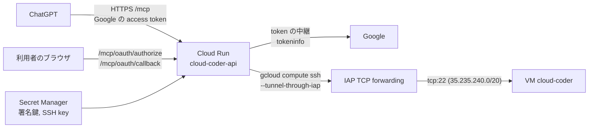

# infra: HTTP API を Cloud Run で動かす

`cloud-coder api` ([HTTP API](../README.md#http-api)。MCP over HTTP) を Cloud Run に置き、ChatGPT などの MCP クライアントから VM を操作できるようにする Terraform です。リポジトリ直下の `Dockerfile` が API のイメージです。



## 作るもの

| リソース | 内容 |
| --- | --- |
| `google_cloud_run_v2_service.api` | `cloud-coder-api`。最小 0 / 最大 1 インスタンス、リクエストタイムアウト 600 秒。**`allUsers` に `roles/run.invoker` を付けて公開**し、allowlist の Google アカウントの token だけで守る。環境変数 `CLOUD_CODER_PUBLIC_URL` に公開 URL (変数 `public_url`、既定は `https://cloud-coder-api-<project number>.<region>.run.app`。OAuth の issuer)、`CLOUD_CODER_GOOGLE_CLIENT_ID` (変数 `google_oauth_client_id`)、`CLOUD_CODER_OAUTH_ALLOWED_SUBS` (変数 `oauth_allowed_subs`) と、下の Secret を渡す |
| `google_service_account.api` | `cloud-coder-api`。API の実行 SA |
| `google_project_iam_custom_role.vm_operator` | `compute.instances.get/start/stop/resume/setMetadata`。**VM 1 台にだけ**付与 |
| `google_project_iam_custom_role.project_reader` | `compute.projects.get` だけ。`gcloud compute ssh` が project を読むため project に付与 (追加のみの `_iam_member`) |
| `google_iap_tunnel_instance_iam_member.api_ssh` | VM 1 台への IAP トンネル (`roles/iap.tunnelResourceAccessor`) |
| `google_compute_firewall.iap_ssh` | `cloud-coder-allow-iap-ssh`。IAP の範囲 (35.235.240.0/20) から network tag `cloud-coder` の VM への tcp:22 を許可 (優先度 1000) |
| `google_compute_firewall.deny_other_ssh` | `cloud-coder-deny-other-ssh`。それ以外 (0.0.0.0/0) から network tag `cloud-coder` の VM への tcp:22 を拒否 (優先度 1001)。`default-allow-ssh` (優先度 65534) などの許可より先に効き、IAP の許可より後に評価されるので、VM には IAP 経由でしか SSH できない。他の VM には影響しない |
| `google_artifact_registry_repository.api` | `cloud-coder` (Docker)。最新 3 バージョンは残し、それ以外で 30 日を過ぎたイメージを消す |
| `google_secret_manager_secret.api` | `cloud-coder-api-oauth-signing-keys` (Google へ渡す `state` の署名鍵) / `-ssh-key` の入れ物。値は gcloud で入れる |
| `google_project_service.this` | 使う API を有効化する。destroy しても無効化しない |

- VM は cloud-coder が作成・起動・停止するので Terraform では管理せず、data source で読むだけです。cloud-coder が作る VM には network tag `cloud-coder` が付きます。それより前に作った VM には `gcloud compute instances add-tags <instance> --tags=cloud-coder --zone=<zone>` で付けてください。
- 他の用途と共有している project でも使えるように、Terraform はここに書いたリソースだけを持ちます。`default` network、`default-*` の firewall ルール、project の IAM policy 全体には触りません。
- secret の値 (署名鍵、SSH 秘密鍵) は Terraform の state に入れません。Google の client secret は API も Secret Manager も持たず、ChatGPT のアプリにだけ入れます。Terraform は入れ物だけを作り、値は `gcloud secrets versions add` で入れます。

## 初回の構築

`terraform` 1.11 以上と、対象 project の Owner 相当の権限で認証した `gcloud` が必要です。VM は先に `cloud-coder up` で作っておきます (API は VM を作れません)。VM を作り直したら、VM に付けた IAM も消えるので `terraform apply` をもう一度実行してください。

### 1. state 用の bucket を作る

```bash
PROJECT=<project>
gcloud storage buckets create gs://$PROJECT-tfstate --project $PROJECT --location asia-northeast1 \
  --uniform-bucket-level-access --public-access-prevention
gcloud storage buckets update gs://$PROJECT-tfstate --versioning
```

### 2. 変数を書いて、Cloud Run 以外を作る

`infra/terraform.tfvars` (git には入りません):

```hcl
project_id = "<project>"
# 手元の config.yaml に vm / git / claude セクションがあれば、同じ内容をここに写す
# config_yaml = <<-EOT
#   claude:
#     dotfiles_repo: https://github.com/OWNER/dotClaude.git
# EOT
```

API が使う config.yaml の `gcp` セクションと `ssh` セクションは、変数 `project_id` / `zone` / `instance` / `ssh_user` から作ります (`ssh.iap` は常に `true`)。残りのセクションは変数 `config_yaml` から取ります。VM agent は、agent のコードか設定が前回のインストール時と違うと入れ直されます。手元と Cloud Run で交互に入れ直されないように、次の 3 つを揃えてください。

- `config_yaml` と、手元の config.yaml の vm / git / claude セクション
- `ssh_user` と、手元の `ssh.user`
- イメージをビルドする commit と、手元の cloud-coder のバージョン

```bash
cd infra
terraform init -backend-config="bucket=$PROJECT-tfstate"
# firewall ルール cloud-coder-allow-iap-ssh を手で作ってある場合だけ、先に state へ取り込む
# terraform import google_compute_firewall.iap_ssh projects/$PROJECT/global/firewalls/cloud-coder-allow-iap-ssh
terraform apply   # image_tag が未設定の間は Cloud Run service を作らない
```

### 3. Google の OAuth client を作る

ChatGPT は Google の OAuth client で接続します (API は認可・コールバック・トークンを Google へ中継するだけ)。Google の OAuth client は Terraform で作れないので、Google Cloud Console で作ります。scope は `openid` と `email` だけで、Google の API の権限は求めません。

1. **Google Auth Platform** (APIs & Services → OAuth consent screen) でアプリを構成する。利用者の種類は、使う人が組織の Google Workspace のアカウントなら **Internal**、そうでなければ **External**。scope は追加しない (`openid` と `email` だけなら、公開ステータスが「テスト」でも refresh token は 7 日で切れない。https://developers.google.com/identity/protocols/oauth2#expiration)。
2. **Clients** (Credentials) → **Create client** → 種類 **Web application**。
   - Authorized redirect URIs: `<公開 URL>/mcp/oauth/callback` (例: `https://cloud-coder-api-<project number>.asia-northeast1.run.app/mcp/oauth/callback`)。この 1 つだけ。
3. 表示された client ID を `terraform.tfvars` の `google_oauth_client_id` に入れる。secret は ChatGPT のアプリにだけ入れる ([how-to-use の ChatGPT から使う](../how-to-use.md#chatgpt-から使う))。

`terraform.tfvars` に足すもの:

```hcl
google_oauth_client_id = "<client ID>.apps.googleusercontent.com"
oauth_allowed_subs     = []   # 自分の sub が分かったら ["1234567890…"]
```

自分の `sub` は、デプロイ後に ChatGPT から接続して tool を呼ぶと、断った記録としてログ (`OAuth: refused a token of a Google account not on the allowlist: <sub>`) に出ます。それを `oauth_allowed_subs` に入れて `terraform apply` します。

### 4. secret の値を入れる

```bash
# Google へ渡す state の署名鍵 (32 文字以上)
openssl rand -base64 32 | tr -d '\n' \
  | gcloud secrets versions add cloud-coder-api-oauth-signing-keys --project $PROJECT --data-file=-

# API が VM に SSH するための鍵。手元には残さない
d=$(mktemp -d) && ssh-keygen -q -t ed25519 -N "" -C coder -f "$d/key" \
  && gcloud secrets versions add cloud-coder-api-ssh-key --project $PROJECT --data-file="$d/key"; rm -rf "$d"
```

公開鍵は API が最初に SSH したときに `gcloud compute ssh` が VM の metadata (`ssh-keys`) に追加します。project の metadata には入りません。

Cloud Run の revision は、これらの Secret に version が無いと起動しません (古い revision が動き続けます)。

### 5. イメージを作ってデプロイする

イメージのタグは Terraform の変数 `image_tag` が持ちます (`gcloud run deploy` は使いません)。

```bash
TAG=$(git rev-parse --short HEAD)
gcloud builds submit --project $PROJECT --region asia-northeast1 \
  --tag "$(terraform output -raw image):$TAG" ..
# terraform.tfvars に image_tag = "<TAG>" を書いてから
terraform apply
terraform output -raw url
```

更新するときも同じです: イメージを作り、`image_tag` を変えて `terraform apply`。

## URL を取り出して確かめる

```bash
URL=$(terraform -chdir=infra output -raw url)
MCP_URL=$(terraform -chdir=infra output -raw mcp_url)

# アプリが動いているか (token 不要)。authorization_endpoint と token_endpoint が
# <URL>/mcp/oauth/authorize と /mcp/oauth/token であること
curl -s "$URL/.well-known/oauth-authorization-server"
# OAuth の事象のログ (Google の code の受け渡し、token の発行と更新、拒否)。token などの値は出ない
gcloud logging read 'resource.labels.service_name="cloud-coder-api" AND textPayload:"OAuth:"' \
  --project $PROJECT --freshness=1d --format='value(timestamp,textPayload)'
```

MCP クライアントには `mcp_url` を使います (`url` とは別の、Cloud Run の決まった形の URL。OAuth の issuer と resource はこちらです)。Cloud Run → IAP → VM の経路は、ChatGPT から `status` tool を呼んで確かめます。接続は [how-to-use の ChatGPT から使う](../how-to-use.md#chatgpt-から使う) を参照してください。

- Cloud Run は `/healthz` を予約しているため、Cloud Run 上では `GET /healthz` がアプリに届かず 404 になります。生存確認には上の OAuth の metadata を使ってください。
- 1 回の呼び出しごとに IAP 経由の SSH が入るので、VM に触る tool は数秒かかります。インスタンスが 0 から起動するときはさらに 2〜3 秒かかります。

## 前の構成 (自前の token と同意画面) から移る

この版から API は自前の token を出さず、Google の token を中継・確認します。Secret `cloud-coder-api-oauth-client-secret` / `-google-client-secret` は使わなくなり、Terraform から外れました (`terraform apply` で削除されます)。

1. Google Cloud Console で、既存の Google の OAuth client の Authorized redirect URIs に `<公開 URL>/mcp/oauth/callback` を**追加**する (前の `<公開 URL>/authorize/google/callback` は手順 6 まで残す。ロールバックに使う)。
2. **手順 3 の `terraform apply` で Secret が削除されるので、その前に** Google の client secret を手元に用意する (Console で表示できなければ新しく作る。前の構成の Secret `cloud-coder-api-google-client-secret` にも入っている: `gcloud secrets versions access latest --secret cloud-coder-api-google-client-secret --project $PROJECT`)。
3. 初回の構築の手順 5 (新しいイメージ、`image_tag` を変えて `terraform apply`)。
4. ChatGPT のアプリを作り直す (Client ID / secret は Google の client のもの)。前の接続 (client ID `cloud-coder`) は使えなくなる。
5. 60 分以上何もせずに置き、再接続せずに `status` を呼べることを確かめる ([docs/mcp-oauth.md](../docs/mcp-oauth.md#実機での確認手順))。
6. 確かめられたら、Google の client から前の redirect URI `<公開 URL>/authorize/google/callback` を消す。

## 止める・取り消す

| したいこと | 方法 | 効果 |
| --- | --- | --- |
| ある人の接続を止める | `oauth_allowed_subs` から `sub` を外して `terraform apply` | 新しい revision から、その人の token は通らない |
| すべての接続を止める | Google Cloud Console で OAuth client を無効にするか削除する | 新しい token も refresh も出なくなる。発行済みの access token は期限 (約 1 時間) まで tokeninfo が有効と答えうるので、急ぐときは下の「API ごと止める」も |
| ChatGPT 側の資格情報が漏れた | Google の client secret を作り直し、ChatGPT のアプリの secret も更新 | 古い secret では code の交換も refresh もできない |
| 本人が自分の接続を取り消す | https://myaccount.google.com/connections でこのアプリのアクセスを削除 | その人の refresh token が取り消される |
| すぐに API ごと止める | `gcloud run services update cloud-coder-api --region asia-northeast1 --project $PROJECT --ingress internal` | 外から `/mcp` に届かなくなる (すぐ効く)。次の `terraform apply` で公開に戻るので、止め続けるなら `terraform.tfvars` から `image_tag` を消して apply (service を削除)。VM の自動停止はそのまま動く |

環境変数は revision の起動時に読まれます。Secret や変数を変えたら、新しい revision が動くまで (`terraform apply` が新しい revision を作るか、インスタンスが入れ替わるまで) 古い値で動きます。

## 鍵を入れ替える

署名鍵 (`cloud-coder-api-oauth-signing-keys`) が守るのは、認可の途中 (最長 10 分) の `state` だけです。新しい鍵だけの version を追加して新しい revision を作れば入れ替わります (その瞬間に認可の途中だった人は、接続をやり直します)。接続済みの token には影響しません。

## ロールバック

新しい revision で接続できない場合は、旧 revision にトラフィックを戻します。旧 revision は削除された Secret を参照するので、戻すには旧版のチェックアウトで `terraform apply` し直して Secret を作り、値 (自前の client secret、Google の client secret) を入れ直します。ChatGPT のアプリも旧構成 (client ID `cloud-coder`) で作り直します。Google の client の前の redirect URI は、移行の手順 6 までは残っています。

## セキュリティ

- この endpoint はインターネットに公開されています。`/mcp` を守っているのは、allowlist の Google アカウントの、この Google の client 宛ての token だけです。設計と根拠は [docs/mcp-oauth.md](../docs/mcp-oauth.md) にあります。
- **access token は VM のシェルと同等の権限です。** 持つ相手は VM を起動・停止し、任意の repository を clone して Claude Code にプロンプトを渡せます。Claude Code は VM 上でコマンドを実行でき、VM には Claude Code と GitHub の認証情報があります。Google の client secret も同じ重さで扱い、ChatGPT のアプリに入れる人だけが持ってください。
- 使えるのは `oauth_allowed_subs` の Google アカウントだけです。Google アカウントには 2 段階認証 (passkey など) を設定してください。
- refresh token は Google が出し、ChatGPT (OpenAI) が持ちます。寿命は Google が決めます (取り消すまで、6 か月使われないまで、または 1 アカウント・1 client あたり 100 個を超えて古いものから)。止め方は上の表です。
- 認可の URL は、誰かが送ってきたリンクからも開けます。redirect URI は ChatGPT の固定の URL なので、他人のコネクタに code が渡りえます。code を token に換えるのを止めているのは、Google の client secret の秘匿だけです (Trillion OS と同じ性質)。
- Cloud Run のアクセスログには、`/mcp/oauth/callback` の URL (1 回限りの Google の code と `state`) が残ります。code の交換には PKCE の verifier と Google の client secret が要ります。
- API の実行 SA が操作できるのはこの VM 1 台 (起動・停止・metadata) と IAP トンネルだけで、project 全体への権限は `compute.projects.get` だけです。VM を作成・削除することはできません。
- network tag `cloud-coder` の VM の tcp:22 は IAP の範囲からだけ開いています。手元の CLI も IAP 経由 (`ssh.iap: true`、既定) で接続します。`ssh.iap: false` ではこの VM に SSH できません。VM の外部 IP は外向きの通信 (GitHub、Claude) のために残しています。
- 最大インスタンス数を 1 にしているので、大量のリクエストを受けても費用は 1 インスタンス分に収まります。

## 費用

アクセスが無いとき Cloud Run は 0 インスタンスになり、課金されません。常に掛かるのは、Artifact Registry のイメージ (1 個 約 300MB)、Secret Manager の secret 2 個、state bucket だけで、月に数十円程度です。VM の費用は API とは別で、cloud-coder の自動停止に従います。

## 片付ける

```bash
terraform destroy
```

API、SA、IAM、イメージ、secret と、firewall ルール `cloud-coder-allow-iap-ssh` / `cloud-coder-deny-other-ssh` が消えます (手元から IAP で SSH している場合はそれもできなくなります。`default-allow-ssh` があれば外部 IP への SSH が再び通ります)。VM、`default` network、有効化した API は残ります。カスタムロールは削除から 7 日間は同じ ID で作り直せないので、すぐに作り直す場合は `role_id` を変えてください。
